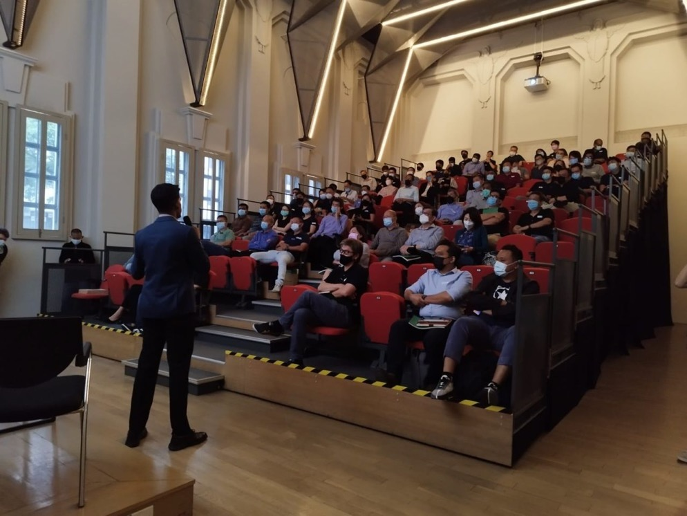

## The Why

COVID-19 revealed that Singapore wasn't doing enough for migrant workers - the pandemic was spreading quickly, because migrant workers were living in densely-populated dormitories with little safe management measures in place. On the other hand, robust government policies allowed us to quickly contain the virus outside of dormitories. It looked almost as though there were two Singapores - one within the dormitories, and one outside of it. The way COVID-19 cases were reported revealed this clearly. Two figures were reported at the end of each day: one for the number of cases within dormitories, and one fo the number of cases outside dormitories.

As a Year 4 student, I was beginning to develop the strong convictions I have today, that all individuals deserve dignity - regardless of whether they are here just for a salary, or here because they want to stay permanently. I wanted to do more in my capacity as a student to advocate for better living standards for migrant workers.

## Overview

The opportunity to work with the Dormitories Association of Singapore Limited (DASL), a trade organization involving leading dormitory operators, came through a program I was previously in - the Singapore Young Leaders' Summit. 

Through robust engagements with DASL as well as direct interviews with migrant workers, academics, policymakers, civil society advocates and architects, we developed a much better understanding of the migrant worker dormitories landscape. We learnt about the key planning considerations and limitations of dormitory operators. We also questioned and revisited assumptions we had made about dormitories and the industry more broadly along the way.

As an end product, our team put together a Future Thinking study that investigated how migrant worker dormitories in 2040 can better meet migrant workers' needs. We investigated how potential changes in technology, the climate, demographics, culture and society could necessitate adaptations or create new opportunities for migrant worker dormitories. The report can be found [here](https://sites.google.com/view/projecttreehouse).

My teammates and I presented this report at a national forum involving over 40 stakeholders across the industry, government and ciivl society.

