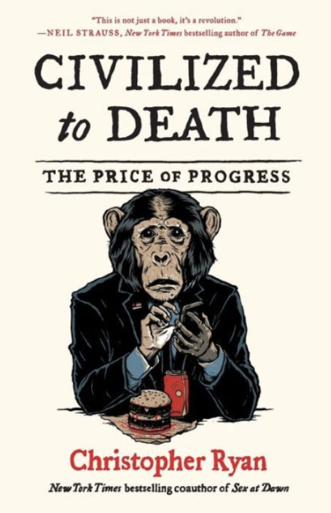
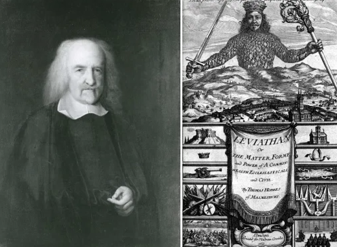
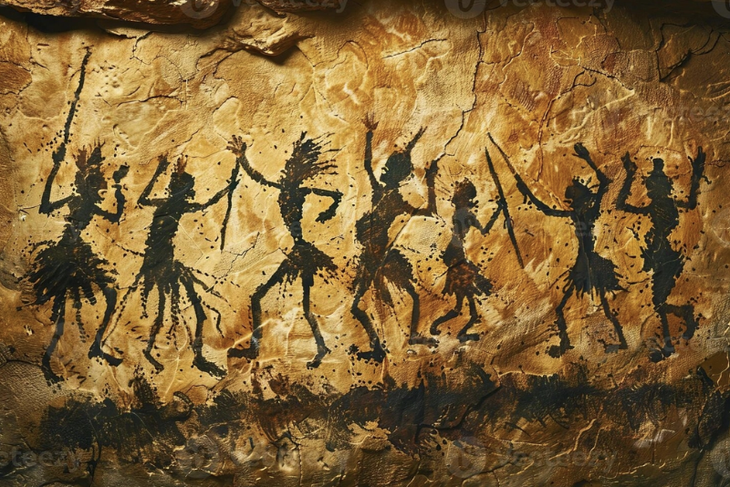
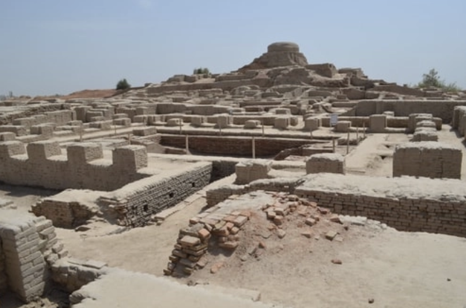

*Civilized to Death* by Christopher Ryan was part of my Winter Break 2025 reading. The book was recommended to me by a friend who took a course on capitalism and how it has harmed the well-being of those who live under its systems. Fair warning: I read this book 2.5 months ago, so not all the information is fresh in my mind. But perhaps that’s a good thing, because only the most memorable takeaways are in my mind. 

# Summary

The book’s central thesis is that the idea of “civilization” itself is a misleading myth. We did not become more “civilized” through the imposition of civilization as we currently conceive of it. Ryan argues that before the advent of civilizations, we were not the “savages” we are sometimes portrayed to be. 

To the contrary, Ryan argues that social interactions, health, institutions and well-being were far higher in those times. Rather than “civilizing” people, “civilization” has created new conflicts and worsened human well-being. In doing so, Ryan questions a foundational justification of modern government — that without a Hobbesian Leviathan, human life will be nasty, brutish and short. Interestingly, Ryan even questions the origin story of Hobbes’ theory, arguing that Hobbes was particularly cynical because he grew up in a fraught time of English history. 

Ryan takes his central argument that civilization is a myth, and applies this argument to a range of examples of how “civilization”, as we know it, has made life more miserable rather than improving it. 

# My take

This book wasn’t the most balanced. It comes across as a sledgehammer, merely stating the ways which civilization has been harmful without considering the genuine case that civilization has created certain benefits. At best, he suggests that pre-civilization tribes already enjoyed many of the benefits that we think modern civilization offers. 

I don’t buy this line of argument. I think the counter-factual is incredibly problematic. As a matter of methodology, I doubt we have much good information about tribal societies, compared to the amount of information we have about modern civilization. With such source limitations, I’m not sure how justifiable Ryan’s rose-tinted lens view of ancient tribes are. 

One clear example is when Ryan talks about how justice systems weren’t necessary in tribal societies — tribes simply resolved them through discourse and conversation. But how did tribes treat individuals outside of their tribe when they committed crimes? Probably not very well at all. To the contrary, civilization and legal systems have sought to both prevent crime *and* cruel or unusual punishment — Foucault lays out an interesting narrative of this transition in *Discipline and Punish*. 

But I think Ryan’s biggest faux pas in this book was conflating criticisms of civilization with criticisms of colonial conquest. True, the introduction of “civilization” was often led by colonial powers. True, that colonization was a brutal, awful process. But equating colonization with civilization, too, is unfair. There have been non-colonizing civilizations in history — for example, the Indus Valley civilization was notably more peaceful than peer comparisons. 

All that said, Ryan has a massive point: perhaps we’re being too unimaginative about what civilizations need to look like. Perhaps we’re way too cynical in our assumptions about human nature, and our expectation of governments — and these assumptions and expectations might be feeding our status quo bias. 

I wrote about this in another piece about a [politics centered on happiness](https://www.sanjaaybabu.com/writing/happiness-1). Possibly, older societies offer a guide in building stronger communities that preserve well-being (I wouldn’t be surprised if well-being was one thing that older societies were better at). 

Ryan is also right that good things don’t *necessarily* need to come from the government. Many efforts at promoting well-being and development are excessively statist — just consider the failed [Thaba-Tseka development project](https://s3.amazonaws.com/files.commons.gc.cuny.edu/wp-content/blogs.dir/1989/files/2014/08/Ferguson-The-Anti-Politics-Machine.pdf) in Lesotho. 

Famously, Elinor Ostrom showed that governments aren’t the only game in town. Markets and civil society play a crucial role in creating stable and socially-optimal outcomes. The tribal societies Ryan portrays in this book reveal the positive outcomes that can arise through strong civil society action. Ryan’s argument complements Ostrom’s point, that perhaps in our status-quo bias towards strong central government, we don’t treat civil society seriously. 

<Callout>

**My overall take:** Read this book. You’ll certainly benefit from the arguments raised from Ryan. My disagreements here are a sign that Ryan got me thinking in this book, and I’d love to hear whether you have any other views on this book. 

</Callout>

# 3 things I learned

1. Tribal societies were highly stable and prosperous, albeit in a different way from we are now. It’s worth investigating what we characteristics / institutions from tribal societies we want to bring into our life today.
2. Many of the problems we face today — from dental issues to non-communicable diseases — are “created” through the structures around us. It’s worth thinking about the costs of the prosperity and abundance that characterize modern life. 
3. *Homo homini lupus* (Man is wolf to man) might be a construct and a limiting mental model. It was conceived under very specific conditions by Hobbes, and should be put to scrutiny. 

# 2 connections I made

1. The homogenous “discourse” of civilization reminds me of how World Bank developers imposed free-market models in Lesotho’s agricultural societies, thinking that’s the only way agriculture can work. Rather, the Basotho people herded animals for pleasure, not for money. 
2. The dialogue about justice systems in tribal societies reminded me of my restorative justice class. Such justice relies heavily on having a strong pre-existing social compact. That might be true within tribal societies, but it might not apply to those outside of it. Reminded me of why my conclusion from that class was that I still saw the value of laws, but wanted more restorative practices incorporated. 

# 1 lingering question I had

Is there a way to re-create the tight-knit tribal intimacy of tribal societies in modern society today? And along that vein, are the well-being dividends of tribal societies mutually-exclusive with the structures of civilization that we’ve created today?