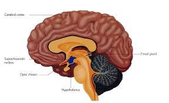
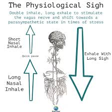

Over my last few gym sessions, I’ve been listening to a podcast by Dr. Andrew Huberman about how to optimise your body’s cortisol cycle for cognitive, physical and psychological performance. Dr. Huberman presents a podcast called Huberman Lab, a favourite amongst “bio-hackers” — individuals who use a range of science-based techniques to maximise their biological potential.

Why am I curious about cortisol? On hindsight, my curiosity about this steroid hormone stemmed from a misconception I had. Cortisol is often known as the “stress hormone”, often blamed for the phenomenon of “burnout” — something I hear very frequently from those who went through the Singapore educational pathway, and high-achieving students here at Duke. I understand how a rut of burnout can be incredibly hard to overcome, and wanted to understand the science behind it. 

[The podcast](https://open.spotify.com/episode/7BrckKlYB9u9cW5Nd7GTxs?si=ff27d8c830724d0a) is more than two hours long, so here’s a summary I’ve written about what cortisol is, how it is synthesized and released, and how we can make the most of it. I’ll summarise this into ten main headline takeaways that I hope you can benefit from. As usual, I would recommend you to follow the mantra “trust but verify” — if you think there are some conclusions or arguments here that are dubious, I welcome you to do some digging. I would love to hear from you. 

# 1. Busting a myth: Cortisol does not cause the feeling of stress.

Cortisol is NOT a stress hormone. It is an **energy allocation hormone**. Cortisol helps you send enough glucose to the parts of your body that need it most, including *in response to stress*. 

Stress isn’t the only cause for a release of cortisol, though. The suprachiasmatic nucleus (SCN) orchestrates the release a high amount of cortisol in order to give your body enough energy to wake up, regardless of whether you’re stressed or not. Key takeaway: Cortisol ensures you have enough energy to go about your daily life, AND take on the stressors around you.

Specific to stress, cortisol works hand-in-hand with adrenaline and norepinephrine. But cortisol takes a little longer to enter into your bloodstream — it first has to be synthesized. The SCN produces Corticotropin Release Hormone (CRH), which in turn causes the production of ACTH, which then causes the synthesis and release of cortisol into the blood stream. Cortisol typically kicks in about 10 minutes after the stressor manifests, which explains why when you go through a harrowing experience, the feeling of stress remains for a while after.

You need cortisol! The issue, though, is if you have low cortisol at the start of your day and high cortisol at the end of your day. Even night owls follow a pretty typical pattern of cortisol, just that it’s offset by a few hours.

# 2. The best case scenario: High cortisol in the morning, low cortisol in the evening.

It’s not actually good for you to have either high or low cortisol all the time. Rather, the concentration of cortisol in our bloodstream follows a regular pattern. This regular pattern is takes a four key cycles:

1. 4 hours before to 2 hours after lights out — *minimal secretion of cortisol*
2. 3 hour preliminary nocturnal secretory phase, in the third to fifth hour of sleep — *very small amounts of cortisol produced*, in tandem with slow wave deep sleep
3. 6th, 7th and 8th hour of sleep — *cortisol rises very quickly*, correlating with REM sleep. High levels of cortisol allow you to wake up. NOTE: This is why you need 6+ hrs of sleep a day. 
4. The first hour after you’re awake — you have an opportunity to *amplify* your cortisol level through lifestyle practices.

Here’s an important thing to note: Once you’re done with the first hour after you’re awake, there aren’t many opportunities to increase the cortisol level in your body. So that first hour is critical. From there, cortisol levels are typically meant to fall. 

The Hypothalamus-Pituitary-Adrenal axis uses a negative feedback loop to essentially figure out how much cortisol your body actually needs, and supply only that amount. When there are very low amounts, it knows it has to increase cortisol. When there are very high amounts, it knows it has to clear cortisol. 

For night owls, you still follow these circadian cycles. However, they’re offset by a few hours. A night owl’s “4 hours before to 2 hours after lights out” might be 11pm to 5am, while mine is probably 7pm to 1am.

Of course, this is in the absence of behaviors that spike cortisol. A lot of the issues we face — being exhausted unproductive in the day, but being stressed at night, or waking up incredibly anxious — are caused by a misregulated cortisol cycle. Addressing your stressors is a good thing; having an awareness of how you process and deal with your thoughts is probably a mature thing to do. But there are some lifestyle changes you can make to have a more reasonable cortisol cycle. 

So, combining these two facts, there are two key levers if you’re trying to optimise your cortisol cycle:

1. You need to elevate your cortisol levels in the day.
2. You need to depress your cortisol levels at night.

These reinforce one another. When cortisol levels are high in the day, the negative feedback loops do the requisite work to moderate it down at night. When your cortisol levels are low at night, the SCN knows to elevate it after deep sleep.

# 3. Maximising your first hour in the day: Bright light, hydration, caffeine

The first hour of the day is incredibly important. This is your only window to amplify your cortisol, before it starts declining for the rest of the day. From there, you can only try to moderate the decline in cortisol. 

The first thing you should do, according to Dr. Huberman, is look at bright light. Your overhead lamp isn’t enough — only sunlight is bright enough. This is because the SCN can gather information from the retina, and the presence of light within the first hour of waking up can trigger a parallel pathway of cortisol release.

Also, ensure you are well-hydrated. Dr. Huberman suggests 500ml-1L of water in the morning, preferably with electrolytes. Hydration is probably the most over-stated but under-followed piece of health advice.

How about caffeine? If you don’t drink caffeine at all, caffeine is highly effective at spiking your cortisol. But if you are accustomed to drinking caffeine, it only slows the *decline* in cortisol throughout your day. So there’s theoretically no harm drinking coffee the first thing after your sunlight and hydration, but Dr. Huberman suggests waiting 90 minutes before consuming coffee or your preferred source of caffeine. This helps flatten out the dip in cortisol which begins 90 minutes after waking up. 

# 4. Exercise and cortisol: Change things up

Exercise increases cortisol, but the level to which it does so is variable. Generally, if you do the same kind of exercise at the same time in a predictable rhythm, then cortisol doesn’t *spike*. It does, however, predictably and moderately rise according to your exercise rhythm — the body knows you’re going to exercise, so it increases cortisol to provide the needed energy. 

If you change up your schedules or the type of exercises you do (e.g. you’re normally an endurance athlete, but today you’re doing strength training), then you’re more likely to see a rise in cortisol. 

There was a pretty long sharing about the effects of night exercise. My big takeaway from that is that late night exercise isn’t ideal, because it does increase evening cortisol — you don’t really want that. But there are things you can do to lower your cortisol in the evening that I’ll talk more about. 

Nevertheless, Dr. Huberman’s advise is: train when you can. Cortisol aside, exercise releases catecholamines including dopamine and norepinephrine, which makes you feel good.

# 5. Lowering cortisol in the evening: Light, food, breathing, supplements

The next part of your cortisol regulation journey is to reduce evening cortisol. There are four main “categories” to think about here. 

## 5.1. Light: The Critical "Re-Opening" Window

About two hours after sundown, your system enters a high-sensitivity phase. During this time, even small amounts of short-wavelength (blue) light can trigger an unnatural cortisol spike, tricking your brain into thinking it’s morning.

Switch to dim, low-placed, warm-toned lights (like floor lamps or candles) after 8:00 PM. In general, try to avoid bright overhead lights to prevent the "circadian dead zone" from being disrupted by artificial "noons." Also, set your phone screens to totally block off red light. Alternatively, get a pair of red-light blocking glasses. 

## 5.2. Food: Strategic Starchy Carbs

While low-carb diets are popular for weight loss, they can sometimes keep cortisol elevated.

If you struggle to lower cortisol in the evening, try incorporating "clean" starchy carbohydrates (like sweet potatoes, homemade pasta, or fruit) into your dinner. Note: you don’t have to do this! If you normally get sleep well at night, then you don’t need to incorporate carbs into your diet. 

Carbohydrates can help facilitate the transition of tryptophan into the brain, promoting serotonin and melatonin production, which naturally counters the "alertness" of cortisol.

## 5.3. Breathing: The Physiological Sigh

Don't wait for a massage or a vacation to de-stress; you can override your nervous system in real-time. If you feel "tired but wired" in the evening, use exhale-emphasized breathing.

How? Take a deep breath in through the nose, followed by a second, shorter "top-off" inhale to fully expand the lungs. Then, perform a very long, slow exhale through the mouth. This is called the [psychological sigh](https://www.youtube.com/watch?v=rBdhqBGqiMc).

This simple mechanical action pops the air sacs (alveoli) in your lungs, offloads carbon dioxide, and tells your brain to engage the parasympathetic ("rest and digest") system immediately.

The good thing about the physiological sigh is that it counters the most diabolical thing about cortisol. When your cortisol levels spike due to stress, you tend to do things that further increase it. You don’t want to be doing that. 

## 5.4. Supplements: The Evening Clip

If your cortisol remains high at night, certain supplements can help "clip" the top off that stress response.

- **Ashwagandha:** Shown to reduce cortisol levels by **11–29%**. However, avoid taking this in the morning, as you *want* cortisol high then; save it for the late afternoon or evening.
- **Apigenin:** Found in chamomile tea, this helps quiet the nervous system.

# 6. Type I burnout: “I wake up feeling anxious”

If you wake up feeling incredibly anxious, then you need to ensure that in the 6th, 7th and 8th hour after you wake up, cortisol rises steadily, rather than shooting up too fast.

The best protocol to deal with this is to try to incorporate [yoga nidra or non-sleep deep rest](https://www.youtube.com/watch?v=AKGrmY8OSHM&t=293s) when you find yourself awake, to moderate your cortisol level. These are totally free and are worth trying.

# 7. Type II burnout: “I’m wired and tired”

If you feel tired in the morning and antsy (but not necessarily productive) in the evening, you need to follow the above guidelines. You probably have a messed up cortisol rhythm. That’s something you have to work with. 

And if you suspect you have chronically high cortisol levels, then it’s probably a good idea to speak to a trained healthcare professional.

# Conclusion

Cortisol plays an incredibly important role in our lives. Understanding cortisol is incredibly important to people of all ages. 

For people like me, cortisol ensures that I’m most productive when I have to be, and get rest when I need to rest. I think it’s critical that we sync our biological schedules and our work schedules, so that we can be happy/healthy *and* be effective at achieving our goals at work or school. The two should not be mutually exclusive. 

For older individuals, the cortisol rhythm tends to flatten out - medium in the morning, medium at night. This significantly decreases your resilience against serious health conditions like cancer, and potentially decreases your lifestyle.

I hope these tips help! I’ll personally be experimenting with the no coffee until 90 minutes after waking, and the use of physiological sighs. Will keep you all posted!