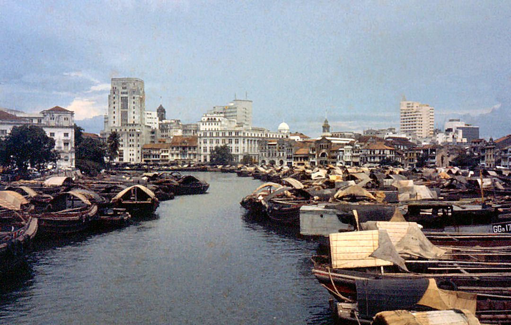

During my ten-month break between completing National Service and starting college at Duke University, I had one big question in my mind: can we make Singapore a happier country?

To be clear, I didn’t think we were *miserable*. All things considered, Singapore’s story has been a tremendous success. We’ve achieved a high standard of living for our citizens, despite not having natural resources. Making the most of the good institutions that were set up and then maintained by the British and Singaporean governments, as well as our strategic location as an Asian hub, we have become an economic success story. Poverty is low, and extreme poverty is essentially non-existent. Socially, citizens still feel a sense of progress: social mobility is still generally perceived to exist. 

All of these seem to paint a pretty picture. This is why I’ve long hesitated to write this series. And here’s a candid admission. The entire basis for this project of mine isn’t very academic or intellectual. It’s frankly a product of “vibes”, of “intuition”, and the kinds of conversations I have with my peers. 

But I’ve decided to go about writing it anyways, because I came to a recent realization. It might be true that we’ve come a long way in creating high quality backdrops for citizens to pursue their own happiness journeys. True, there are some Singaporeans who have indeed succeeded at the pursuit of happiness. And yet, we can / could always do better when it comes to happiness. 

In future parts of this series, I will talk about government politics, social institutions and cultural changes that we might want to make to build a happier country. I might also delve a little into what individuals — within Singapore or otherwise — can do in their own pursuit of happiness.  

But these future parts all share one thing in common: **they hold a normative belief, that a societal push for a politics of happiness is necessary.** And this is NOT at all a simple claim to make. So in this first essay, I will try to defend that proposition.

# Our current approach: “Backdrops” for happiness

Most societies today see happiness as an individual pursuit. Governments merely provide the backdrops for individuals to find their own sense of happiness. If anything, governments need to be a *smaller, not larger* part of individuals’ lives. 

I’m not a political theorist, but I do see the roots of this approach in Hobbes and Locke’s theory of government. Both theorists start by describing the “state of nature” — they construct a hypothetical world where government is absent. These constructions tell us a lot about the values these theories promote. 

Hobbes’ starting assumption is that mankind, paranoid of one another, will be violent in the absence of government: life will be “nasty, brutish and short”. Strong governments, also known as a “Leviathan” characterized by a monopoly over force, are necessary to avoid the chaos of a *dog-eat-dog* world. Locke’s view is slightly less dramatic, but similarly suggests that governments exist to protect individuals’ right to life, liberty and property.

I sense that Hobbes and Locke are the ideological godfathers of government. In their view, government isn’t *inherently valuable.* Government is only useful insofar as WITHOUT one, life would be worse. 

# Questioning assumptions

We need to scrutinize the premises of the above argument deeper.

First: is it true that mankind has to be violent? Isn’t there so much other beauty in humankind — empathy, intuition, trust and hope — that also matters? Why is fear the prevailing characterization of mankind in these ideologies? Christopher Ryan questions this fact in his book *Civilized to Death*, using case studies of tribal societies. I have my issues with that book, but you can read more about that in my [review](https://www.sanjaaybabu.com/writing/civilized-to-death) of the book. Nevertheless, I do see the merit in the argument that we might be taking too cynical a view of humanity in the leading model of government we have. 

Second: is it true that government can never be inherently valuable? Certainly not. In fact, Plato and Aristotle believed that the ideal *polis* — political community, so not exactly a nation — should improve people’s reason and virtue, ultimately promoting their well-being. Citizens here don’t just live their individual lives while government runs silently in the background. Instead, the *polis* is an active enhancement to their well-being.

With all this in mind, why can’t we think about a different conception of government? One that not only exists in the background, keeping societies functional and stable, but actively promotes people’s happiness? 

It would be amazing if we tried that in Singapore, a country which has already succeeded tremendously at being functional. We already have the strong social foundations to aspire for more. 

# Some benefits from a happier population

So far, I’ve examined potential reasons why we might be being too unimaginative about the role governments need to play in promoting happiness. I’ve asserted that perhaps we should try to prioritize citizen happiness. 

Happiness is objectively awesome. But what reasons might governments have to care? Here are some back-of-the-napkin probing questions, tailored to things Singapore cares about:

1. What if happier people are more productive? More creative?
2. What if happier people are healthier, expanding individuals’ healthspans (the duration they spend being healthy) and decreasing the load on our healthcare system?
3. What if happier people are less violent, and care more for one another?
4. What if families comprising of happier people are stronger?
5. What if a happier country attracts the best talent from around the world?

I don’t know any of these conclusively, but I have a sense that some of them are true. As I delve deeper into a more formal study of happiness, I do hope to delve deeper into these probing questions. 

# Why the study of happiness is distinct

If I’ve learnt one thing from my ten-month gap year and my studies so far at Duke, the study of happiness looks very different from conventional public policy or economic analysis. 

The question of how to build a happier society requires an interesting blend of philosophy, neuroscience / psychology, design, and also a hint of economics and policy. And maybe we don’t *know* (like, *really FULLY* know) that much at all. Happiness is an individual journey, so it might run against the grain of the principles of academic study — replicability, external validity, and rigorous proof. But, maybe part of thinking bigger is the idea that not all solutions need to stem from the same set of methodological principles. N=1, in any case, is a huge part of our day-to-day lives. 

All this is to say that the field of happiness study isn’t easily subsumed under any other field. Rather, it’s a unique amalgamation of methods.

# Conclusion

Here’s the long and short of it — I have a feeling that happiness is the next big paradigm Singapore needs to cross as a country. I sense that so much good can come out of this, if we only break out of our narrow imaginations to think: what *active* role can governments play to enhance people’s lives?

In this series of articles, I hope to examine happiness further, talking both about my personal journey towards happiness, as well as broader social questions about how societies can be structured in a way that optimizes for happiness.

I also hope that this article ignites conversations. If you read this and had any thoughts, please reach out at [babusanjaay[at]outlook[dot]com](mailto:babusanjaay@outlook.com). See you in my next post!