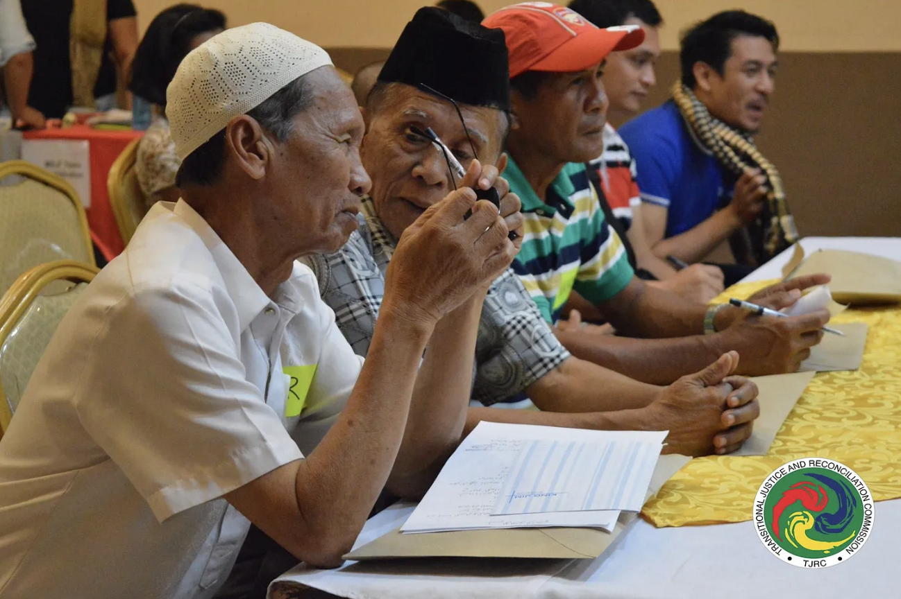

Once the dust settles and the smoke clears after a drawn-out war or revolution, we must ask: what’s next? Communities need accountability, reconciliation and justice. Transitional justice (TJ) projects aim to achieve these outcomes (UNSC 4). Adversarial and retributive models have long been the cornerstone of well-known TJ efforts, such as the Nuremberg Trials and Saddam Hussein’s trial. We thus find it hard to imagine using restorative justice (RJ) practices in transitional justice. However, if restorative justice has the greatest impact in severe cases (Zehr 11), should we use restorative practices in TJ contexts? The critical question, I argue, is not whether to use RJ in transitional justice, but rather how it should be used. An analysis of three case studies reveals the significant benefits of restorative approaches in TJ. However, a well-designed process is needed to (a) overcome trust deficits and the large scale of crime in TJ contexts, and (b) prevent reconciliation from being used as a veneer to avoid structural reform and accountability.

Three implementations of RJ in transitional justice

A 2024 International Center for Transitional Justice (ICTJ) report examined three case studies in which RJ was used in TJ contexts: Colombia’s Special Jurisdiction for Peace (JEP), which investigated abuses in a decades-long armed conflict; Tunisia’s Arbitration and Reconciliation Committee (ARC), formed after the 2011 Arab Spring revolution to investigate the prior dictatorial regime; and the Philippines’ Transitional Justice and Reconciliation Commission (TJRC), created to provide redress for brutality and exploitation against Moro Muslims after a peace deal with separatists in the Mindanao region.

**The utility of restorative justice in transitional justice settings**

In the case studies, restorative practices significantly enhanced transitional justice efforts: restorative practices better meet victims’ needs and facilitate public deliberation.

Traditional punitive systems promise justice, but they often fail their victims. Even after an offender gets ‘what they deserve,’ victims can be left feeling neglected and dehumanized (Zehr 14, 21). By design, RJ fundamentally shifts the focus, asking what victims actually need to heal: information, empowerment, restitution, and truth-telling (Zehr 14-15). Specific to transitional justice, a punitive process ‘zooms out,’ focusing on how a perpetrator violated the abstract law, not the actual person. Victim testimony is often restricted to “relevant testimony” that serves the prosecution’s case (Chakravarthi 225). Restorative processes, in contrast, create space for the victim’s ‘complex, representative narrative’ (ICTJ ES-3). Rather than serving a purely legal end, victim testimony is a tool for understanding, forcing the perpetrator to confront individuals’ experiences of the harm they caused, and connect it to their “macro-level societal responsibility” to repair society (ICTJ 15). In the process of testifying, victims can also directly face the shame they have experienced, facilitating healing (Brookes 45). The Colombian JEP’s public acknowledgement hearings demonstrated these benefits. The hearings allowed victims to “restor[e] their loved ones’ good name, establish the truth around the crimes and other perpetrators involved, and elicit commitments to non-recurrence,” (ICTJ 13) meeting their need for empowerment, truth-telling and restitution respectively. Seeing value in the JEP’s RJ process, even victims who had previously chosen to disengage from the Colombian peace process began to participate in the acknowledgement hearings (ICTJ 13). This trend confirms that the RJ process was indeed beneficial for victims.

Besides supporting victims’ needs, restorative practices facilitate public moral deliberation in post-conflict settings. In Justice: What’s the right thing to do, Michael Sandel suggested that societies should collectively deliberate on questions of right and wrong. To him, moral deliberation is critical in building societies based on common morals and understanding our obligations to one another (Sandel 243, 268). Deliberation is even more critical in TJ settings, since societal norms and values are often seriously eroded by the crimes that came before. In response, restorative practices founded on the African conception of justice facilitate moral deliberation by “reemphasiz[ing] social values, and reaffirm[ing] the bonds of our inherent interrelatedness” (Davis 23). Applied to transitional justice, restorative practices publicly ponder questions of harm, norms, right and wrong — not just legal questions — about the committed crimes. For example, Colombians’ collective stand that the perpetrators’ acts were “unjust and reprehensible” (ICTJ 17) was a powerful moral statement. Such labeling is powerful: it re-establishes collective moral norms, values and expectations for future relations between Colombians. Moreover, RJ also created a more inclusive and engaged public discourse: the Colombian JEP’s emotional public acknowledgement hearings even reached “people [who were] otherwise indifferent to the judicial process” and those unaware of the heinous cruelty of the Colombian civil war. In facilitating engaged and collective moral deliberation, RJ enables a significant step towards normalcy in transitional justice contexts.

**Procedural challenges**

Evidently, restorative practices add value in transitional justice contexts. However, major procedural challenges stand in the way of TJ officials looking to introduce restorative practices. These challenges include: (1) the scale and volume of harm in TJ settings, and (2) the lack of underlying trust. To address these challenges, a well-designed RJ methodology is required.

Firstly, TJ contexts often involve large numbers of victims and perpetrators. Restorative practices are, however, resource and time-intensive (Turpel-Lafond 290), partly due to their granular attention to context and de-emphasis on expediency. Therefore, facilitating RJ for all victims and perpetrators is challenging amidst resource and time constraints. In Colombia’s case, the JEP initially responded to resource constraints by only having public acknowledgement hearings for high-ranking perpetrators. However, victims demanded that lower-ranking perpetrators be involved too, seeing significant restorative value in their involvement — after all, these lower-ranking perpetrators were the ones that carried out orders and directly inflicted harm on the victims. Victims’ demands, however, could not be met. Due to resource and time constraints, RJ processes involving lower-level perpetrators were brief at best, leaving victims little time to address perpetrators. This limitation frustrated victims and undermined the JEP’s TJ process. Worse yet was the Tunisian RJ process: out of 25,998 requests for arbitration and reconciliation, the ARC only issued 19 arbitration decisions (ICTJ 14). The massive scale of TJ contexts therefore threatens to overwhelm RJ bodies, obstructing their reach and impact.

Secondly, restorative processes need to earn their own legitimacy. States or authorities carrying out RJ are often not automatically trusted. In Canada, a “history of mistrust” between the Aboriginal and non-Aboriginal people created new hurdles for participants to share their experiences (Turpel-Lafond 284). Trust is ostensibly even lower in TJ contexts compared to Canada, given the rawness of the gruesome harm and violence that came before. Therefore, to be effective, RJ needs to build up trust. It must do so by having a sound process that inspires the trust of all parties. The Philippines TJRC’s Listening Process reflected a deliberate attempt to build trust. Community level consultations, expert interviews, field studies and policy interviews involved over 3300 individuals from different backgrounds (ICTJ 15, 22). Despite their best efforts, the TJRC retrospectively realized that their Listening Process underrepresented Islamized Indigenous communities, potentially diminishing the effectiveness and legitimacy of the RJ process (ICTJ 15-16). The TJRC’s shortcomings despite their best efforts underscore the difficulty of building an inclusive restorative process that inspires the trust of fractured communities.

All in all, the case studies reveal the challenges that implementers of RJ might face when working in a transitional justice context. Using an intentionally and thoughtfully designed process can enable societies to overcome these challenges and enjoy the fruits of RJ (Brookes 8).

**Preventing misuse of RJ**

Even after designing a robust RJ method, officials face a greater danger: they must prevent its misuse. RJ and its ethos of healing and reconciliation can be abused by powerful parties to preserve impunity. To counter this, TJ officials must ensure that reconciliation is accompanied by structural reform and genuine accountability.

The Tunisian case study demonstrates how misusing RJ can cause significant harm. On the surface, a restorative process was conducted in Tunisia. The very name of the Tunisian RJ committee, the Arbitration and Reconciliation Committee, reveals the intent for perpetrators to face the truth, meet their obligations arising from the harm they caused, and reconcile with the people. However, the ARC failed to impose accountability, leaving this to a separate third body, the Specialized Criminal Chambers (SCCs). While 173 cases were promisingly referred to the SCCs, these cases were obstructed by successive governments before being categorically quashed in a 2021 coup (Guellali). Furthermore, the ARC did not facilitate any structural reform of the security sector, which was the principal perpetrator of human rights abuse (Guellali). With neither accountability nor structural reforms, the people did not accept the veneer of reconciliation offered by the ARC. When the ARC closed its RJ process with an amnesty policy for selected officials, called the Administrative Reconciliation Act 2017, the Tunisian people took to the streets in protest. With a policy of impunity couched under the language of reconciliation, the ARC’s efforts at transitional justice lost all credibility (ICTJ 20-21). The Tunisian case study therefore reveals the danger of allowing the veneer of RJ to preclude structural reforms and punitive accountability. However, the Tunisia case study should not be interpreted as a shortcoming of RJ in itself. Rather, it reveals the propensity for RJ to be misused, when there is no genuine intent to facilitate healing.

To prevent the risk of RJ being misused to preserve impunity, one solution is a mixed approach. Such an approach would blend facets of RJ, punitive justice and structural reform, allowing for a comprehensive and effective process. Zehr acknowledges that restorative justice is “neither a panacea, nor a replacement for the legal system” (11). Arguably, the aims of the three approaches — restorative, punitive, and reform — are not mutually exclusive. Restorative practices facilitate healing (Zehr 37) and the rebuilding of civic norms and harmony (Davis 23). Punitive justice provides options to deal with perpetrators who do not acknowledge their role in crimes and helps societies combat impunity in vertical conflicts with clear power dynamics (ICTJ 18). Structural reforms seek to prevent the harm from happening again. Blending the three together, the TJ process can better achieve all its aims. The Colombian JEP adopted this mixed approach. While perpetrators who acknowledged the harm they caused were given the chance to meet their obligations through a restorative process, those who did not acknowledge the harm they caused faced harsh custodial sentences of up to 15-20 years. Under this system, perpetrators have a strong incentive to participate in the restorative process; however, for those who still refuse to take accountability, there remain punitive options for accountability. A caveat, however, is that the strong incentives by the JEP to participate in restorative processes might create a false choice for perpetrators — they might acknowledge harm not because they feel ashamed, but rather merely to enjoy a lighter sentence. Perpetrators’ superficial acknowledgement might risk making the restorative process a merely tokenistic one. Future mixed approaches must do their level best to conceptualize a less problematic mixture of RJ and other approaches. Nevertheless, the benefits of a hybrid approach are empirically evident, according to criminologist John Brathwaite (ICTJ footnote 49).

**Conclusion**

In conclusion, the implementations of RJ in Colombia and the Philippines show great promise for restorative practices to facilitate healing in transitional justice contexts, while Tunisia offers a stark warning of how RJ can harm transitional justice if poorly implemented. This analysis is a frontal rebuttal to simplistic claims about RJ’s absolute effectiveness or lack thereof.

The bigger question, therefore, is not whether to use RJ, but how it should be implemented: the process and intent behind RJ’s use is key, as predicted by Brookes (7-8). A thoughtfully conceptualized RJ process, accompanied with structural reform and accountability, offers great hope for the new societies that emerge after the destruction and desolation of large-scale conflict, abuse and repression.

With the case studies emphasizing the need for a high-quality RJ process, stakeholders and peace-building institutions should devote more resources into conceptualizing best practices for how restorative practices can best be incorporated into TJ. Along this vein, countries with peacebuilding aims – such as Switzerland and Qatar – could establish capacity-building institutions to provide technical support to governments and civil society organizations working to introduce restorative practices in transitional justice contexts. The Swiss Federal Department of Foreign Affairs (FDFA)’s support for the ICTJ is a good first step.

A well-designed restorative justice is a powerful tool for societies figuring out “what’s next?” in TJ contexts. While we can never guarantee outcomes, RJ makes it more likely that societies emerge more healed, more united, and with hope for better years to come.

*Works cited*

Brookes, Derek R. Beyond Harm: Toward Justice, Healing and Peace. Relational Approaches, 2019.

Chakravarti, Sonali. “More than ‘Cheap Sentimentality’: Victim Testimony at Nuremberg, the Eichmann Trial, and Truth Commissions.” Constellations, vol. 15, no. 2, June 2008, pp. 223–35. DOI.org (Crossref), https://doi.org/10.1111/j.1467-8675.2008.00486.x.

Davis, Fania E. The Little Book of Race and Restorative Justice: Black Lives, Healing, and US Social Transformation. Good Books, 2019.

Guellali, Amna. “Views: Revisiting Tunisia’s Failed Transitional Justice with an Eye on Syria.” Rowaq Arabi Journal, 14 Apr. 2025, https://cihrs-rowaq.org/views-revisiting-tunisias-failed-transitional-justice-with-an-eye-on-syria/?lang=en.

International Center for Transitional Justice. Transforming Social Relations: Restorative Responses to Massive Human Rights Violations | International Center for Transitional Justice. https://www.ictj.org/resource-library/transforming-social-relations-restorative-responses-massive-human-rights. Accessed 9 Oct. 2025.

Sandel, Michael J. Justice: What’s the Right Thing to Do? Farrar, Straus and Giroux, 2010.

Turpel-Lafond, M.E. “Sentencing within a Restorative Justice Paradigm: Procedural Implications of R v. Gladue.” Justice As Healing | Living Justice Press, Living Justice Press, 2005, https://livingjusticepress.directfrompublisher.com/catalog/book/justice-healing.

United Nations Security Council. The Rule of Law and Transitional Justice in Conflict and Post-Conflict Societies. Report of the Secretary-General S/2004/616, United Nations Security Council, 23 Aug. 2004.

Zehr, Howard. Little Book of Restorative Justice: A Bestselling Book By One Of The Founders Of The Movement. Good Books, 2002.

*Photo credits*

justiceinfo.net, DW, Philippines TJRC