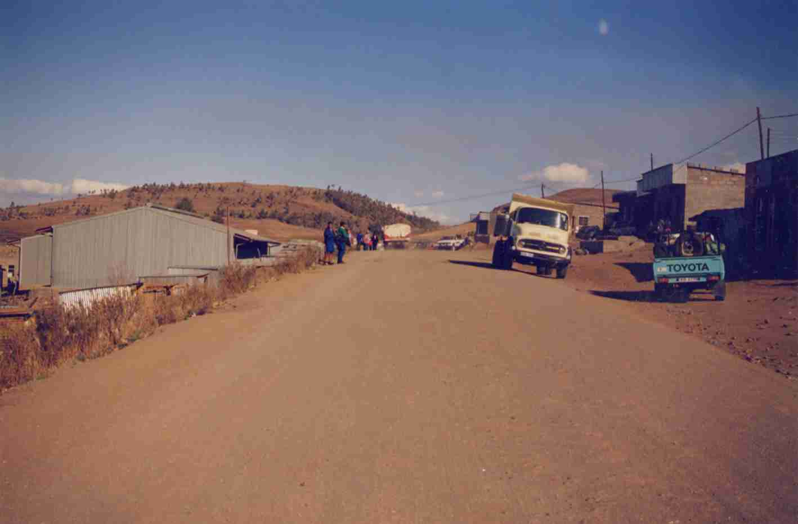

<Callout>
Welcome to Part 2 of “Last Week Tonight”, where I recap some interesting things I learnt over the last week as a college student!
</Callout>

**Development & Human Diversity**

This week, for my course on developmental efforts in Africa, we studied how the field of development was born, and early indications of how the field itself can sometimes be myopic. 

In the post-WWII period, development was conceived as a new way to win the “hearts and minds” of the countries outside the free market, liberal Europe / US and socialist USSR. Efforts to win the support of these countries, many of whom were part of the Non-Aligned Movement, were almost a proxy competition between the US and the USSR. 

I found this incredibly interesting, and morally ambivalent. “Development” efforts are certainly preferable to the way such countries were treated in the colonial period. However, according to Escobar (2012), these efforts at development concealed deeper intentions to maintain influence on former colonies — notably, my professor mentioned that even today, many African countries remain particularly tied to their former colonial rulers, be they France, England or Belgium. 

The readings we went through argued that development itself is a “discourse”. In Foucauldian terms, the concept of “discourses” argue that knowledge is shaped by power, and power shapes what we know. In the case of development, it is only those currently in “developed countries” that have the power to decide what development means, what it looks like, and what the path is to get there. 

The third point — the idea that there are fixed pathways to development — is a notable one. The shortcomings of such an idea is evident in Ferguson’s diagnosis of how and why the Thaba-Tseka project in Lesotho failed. Rather than considering the critical local context of South African apartheid and the presence of leisure farming, developmentalists tried to force fit their “formula” for development into the local context of Lesotho. Even more insidiously, the development project engendered an odd dependence on foreign machinery, potentially causing long-term harm to Lesotho. 

What went wrong? The key issue, it seems, is the fact that developmentalists thought the only way to attain development is through a statist approach, with a strong central government that collects taxes and spends on welfare and infrastructure development. This “way”, however, doesn’t seem compatible with the kinds of societies that were present in Lesotho during the project.

In my view, the failed Thaba-Tseka project, or the idea of development as a “discourse”, should not be seen as evidence to permanently end efforts to improve concrete outcomes for Africans though. Ferguson acknowledges so, himself. 

It’s an overcorrection to dismiss efforts to improve vaccination rates, build more hospitals schools and provide some technical assistance (particularly for institution-building) just because it caused harm, or because people previously used it as a way to gain more power. These are real issues we should engage with. 

That said, we need to have a broader mind regarding pathways to development. Also, we need to understand local contexts before making changes — this is something I learnt while working on much smaller projects such as a sustainability initiative in the Army. The same advise certainly applies to large development projects. 

**Climate action calls**

This week, for our class on climate change, we watched a documentary on Crisis Fatigue — the phenomenon of social media users being overwhelmed with bad news about wars, climate change, disease, and more. 

Being so overwhelmed almost certainly impedes action. First, some choose to habituate themselves. Our brains are wired for survival — if there is a constant output of chaos coming from the news, we choose to tune it out as though it’s a static sound. This is called “habituation”. One method by which we do this is through psychological distancing. We don’t feel as much empathy when climate crises are happening elsewhere, outside of our backyards. The second reason why we don’t act when we’re overwhelmed is that we simply give up. If we’re being bombarded with bad news and we think nothing’s going to work, then we’re likely to just, simply, give up. 

The documentary proposed two solutions. The first is bracketing — the idea that within our minds, we should treat bad news as important, but separate from the hard work we have to do. This solution seems effective, but hard to implement. The second is for climate educators to include “calls for action” in their reporting on the climate. 

I don’t love this idea of calls for action. We’ve already seen many calls for action — “don’t bring straws”, “don’t use plastic bags”, “walk to work”, etc. But these don’t seem to have worked very well. They’re hard to implement, because there are whole systems of convenience in the life we have right now that are hard to undo without significant discomfort. Also, because of “default bias” — a tactic used by many behavioral scientists — we are resistant to change. 

We should use the human inclination to convenience to our advantage. We should design systems that make doing the climate-friendly thing incredibly easy. When I was working on a self-initiated project to increase recycling in the Singaporean Army, I emphasized putting recycling bins right next to general waste bins — mere minutes away from where soldiers changed their ziplock bags and generated most of their plastic waste. This was certainly a big contributor to the high utilization rate of the recycling bins. 

Such a systems-first approach seems like a more capable way at creating behavioral change than merely telling people what to do.

**Life outside of school**

This week, I spent several days doing my work at Mad Hatters Cafe, a lovely spot right off campus. Now that I live and study in the same place, I’ve had to be especially conscious about building routines around where I do my schoolwork. I’ve found this to be a great “third space”, a place to be engaged in more creative work. 

While more focus-dependent tasks, like Mathematics, are best done in quieter, more private environments like my room or the library, tasks such as writing this page are more enjoyable in the cafe setting.