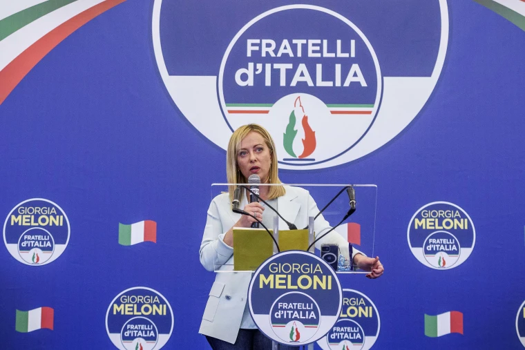
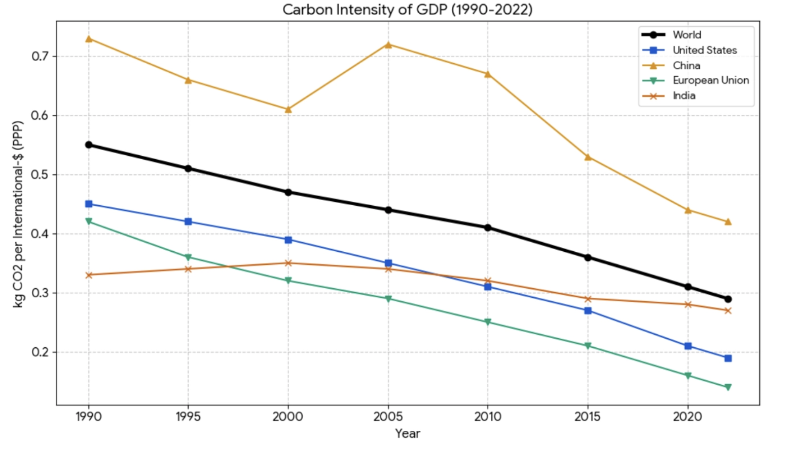

<Callout>
Welcome to Part 6 of “Last Week Tonight”, where I recap some interesting things I learnt over the last week as a college student!
</Callout>

It’s been another packed week of learning! I had to get through a test for Foundations of Econometrics and Data Science, which is in reality just a statistics class. Once getting through that, however, the week took off in its excitement and intensity. 

This week, there are four big stories I’d like to cover.

# The Far Right Today

This week, for my class on the European Union, we took turns presenting about right-wing parties in Europe and their increasing influence in local and regional politics. Well-known examples include AfD (Germany), Reform UK (United Kingdom), and FdI (Italy). 

For my presentation, I studied Italy. The core question of my presentation was: how do parties that campaign on right-wing promises end up governing? I thought this was a particularly pertinent question worth asking, because most European right-wing parties today (including the examples I named) have been powerful agitators, but haven’t gotten to the business of government.

Overall, here was my thesis given what I researched in the Italy case study: **right-wing parties find themselves having to become more moderate once they have come to power**. 

The clearest example is in Italian immigration policies. The Brothers of Italy (FdI) campaigned on the basis of a brutal campaign against refugees — they went so far as to call for a naval blockage to stop refugee boats. However, upon coming to power, Meloni’s administration realized that immigration is critical for Italy’s agricultural and industrial sector. As such, they have sought to broaden pathways for legal immigration, planning to accept 500,000 legal immigrants between 2026 and 2028. At the same time, they have sought to stymie the flow of refugees from source countries by funding development efforts in Africa and the Middle East. This is a surprisingly pragmatic, reasonable stance for a party that campaigned on a much more radical idea, and there is no evidence that this stance has cost FdI support from its voters. 

What can we learn from this? Here’s a thought: perhaps people don’t vote for parties based on their literal campaign promises. FdI voters probably didn’t expect FdI to follow through with their radically right-wing policies (whether they were right or wrong is an open question — FdI’s governance has seen big steps back in some progressive agendas). Instead, economics and “bread-and-butter” issues took precedence. Voters psychologically distanced themselves from the FdI’s socially-conservative ideology because they thought this party would be better for the economy.

I think at some point, voters realized that campaign promises are almost always broken. At some point, the race to overpromise became a game of chicken — a party needs to promise the world, because if you don’t, someone else will. Increasing voter expectations is a big issue as well. Voters expect too much of governments, which contributes to this cycle of overpromising.

So if people don’t vote based on campaign promises, what do they vote by? Perhaps we’re living in an era of sentimental politics. How do I feel about the status quo? How do I feel about each of the candidates, *intuitively*, rather than *rationally*?

FdI’s election, and even their form of governance, suggests that voters still place a premium on this *sense* of them “sharing in” the country’s progress. I want to “feel” as though I’m better off 

This is exactly what many governments are failing to deliver on. Just as governments are failing at delivering on this demand for progress, this question has become incredibly critical. **Governments need to deliver for their people in tangible ways. This is the critical question, whether you’re on the right or the left**. 

And voters need to recognize what progress looks like. In a democratic environment where parties feel the need to overpromise, *voters* — not just other overpromising parties — need to have the discretion to understand the tradeoffs that come with progress, and the fact that progress is often incremental and gradual. Can societies ever rely on all or even most voters being experts to that degree? Perhaps not, but it’ll do us a lot of good to have voters involved in the policymaking process to understand the tradeoffs that come with making policies. 

You can skim through the PowerPoint slides I created for my sharing [here](https://drive.google.com/file/d/1fqFBydk4iPTPHtEXzCvwvORrmrv4Wql7/view?usp=sharing).

# Emissions per $ in GDP: An interesting statistic

While revising for my climate change quiz, I came across an interesting statistic: amongst the top 5 emitting countries/regions, the carbon emissions per dollar in GDP is **falling**. 

That’s a confusing statistic, so let me break that down. The GDP of a country is the sum of final goods and services produced within the geographical boundaries of the country. Take Snowland, a fictional country that produces lollipops. Say, it produces 5 lollipops a year, and these lollipops are worth $2 each. The total GDP is $10. Say, to produce $10, Snowland emits 5 units of greenhouse gases in 2022. If, in 2023, it emits only 4 units of greenhouses gases, then the amount of emissions per dollar of GDP has decreased. 

Amongst the top 5 emitters — the United States, China, India, European Union and Russia — the greenhouse emissions per dollar has fallen. This is a broad trend across most countries, apart from the petro-states like Kuwait and Saudi Arabia. The graph below shows the carbon intensity of GDP — data was mined from the Our World in Data database. 

Why is this happening? Perhaps it’s because we have shifted towards less emissions-intensive sources of energy, like natural gas, nuclear and solar.

I wonder whether this trend will continue as AI data centers massively increase the demand for energy. An important thing to note is that the graph above has 2022 as its last data point. Since 2022, there has been a race between the major AI companies to train better models. As such, I anticipate a sharp increase in that graph with 2026 data accounted for. 

That said, I wouldn’t be surprised if we see some kind of futuristic solution to reduce the emissions that comes with training AI models. [In response](https://www.kumar2net.com/blog/2026-02-14-reply-last-week-tonight-5-sanjaay-babu) to my article from last week, Mr. Kumar A (who is also my uncle!) argued that AI data centers might move to space. He mentioned some of the upsides to this — reduced cooling costs, easier ways to get power safely (e.g. nuclear, solar, etc.). 

My question, though, is: *what push/pull factors will drive such a big change in the way we train AI models?* On one hand, such a move could happen if space launches become incredibly cheap. Then, it becomes more profitable to move your data centers into space, compared with keeping it on the ground. This would be a pull factor, though I don’t anticipate it happening in the near future. The time horizon for us to reduce carbon emissions is shorter than we think — there are several key earth systems that might fail in the near future if we continue at current trends. So, if moving data centers into space *is* the silver bullet, it’s probably not going to come in time through pull factors.

On the other, government regulation could pass laws limiting AI data centers’ emissions, making such innovative approaches *necessary* rather than a “good to have”. But which government will move first on this? No hopeful-AI-leader-to-be will straightjacket their AI industry to that degree. 

# The Language Debate in Africa

What role does language have in decolonization? This week, in my class on development in Africa, we had [Professor Chris Ouma](https://scholars.duke.edu/person/christopher.ouma), a scholar on language in Africa, as a guest speaker to talk to us about language debates. 

Here’s a question — have you ever seen a piece of so-called French literature written in Vietnamese? Probably not. However, in the case of African literature, many prominent writers including Chinua Achebe chose to write in English, the language given to them by colonial powers. 

At the point of decolonization, African writers had to wrestle with the question: what language should we write in? Broadly, there were three positions:

1. **Writing in English/French/Portuguese (Colonial Language):** These became languages that African authors were comfortable in. Furthermore, they were more accessible to a global audience, creating markets for African literature. 
2. **Write in the various African languages**: There were thousands of well-developed language systems in Africa prior to colonization. These language systems were authentically African.
3. **Write in a common, single African language**: The idea was that there should a unifying language for the African continent, an initiative promoted by the pan-Africanism trend in the postcolonial period. 

There was no fixed answer, so each author took their own direction. Attempts at creating a common African language failed, because there were too many ethnic-group differences in Africa that made choosing one single language an impossible task. 

Ngugi wa Thiong’o, a popular African writer, initially wrote in English. However, he eventually decided to start writing in his mother tongue, Gikuyu. In an essay justifying why he made the switch, he argued that reclaiming and re-elevating African languages was a critical pillar in “decolonizing the mind”. The analogy about French literature written in Vietnamese was coined by Ngugi. He argued that Africans’ embrace of colonial languages and disdain towards their mother tongues was one of the mechanisms of neocolonialism. 

He argued that the right thing for him to do was to write in Gikuyu to neutralize the hierarchy between colonial languages and indigenous languages in Africa. 

I thought this is an interesting debate in the field of development studies. Prior to my studies in the US, I always thought of development and governance as a technical issue, often revolving around bread-and-butter issues — can you get food on the table, can you prevent internal conflict, and so on. However, this debate about the role of language in societies showed me that beyond the bread-and-butter issues, there are many unresolved questions in development and governance. 

The bilingual language policy in Singapore, for example, was one way in which we chose to preserve some respect for and connections to our mother tongues, while maintaining English as a convenient language of transactions and business. Viewing the deeper significance of language, this policy has proven its importance to me. 

# Conclusion

It’s been an exciting week, and the excitement is going to continue in this coming week! After the quiz tomorrow, the next big thing I’m looking forward to is the talk with Senator Thom Tillis (R-NC) on Friday. See you guys soon!