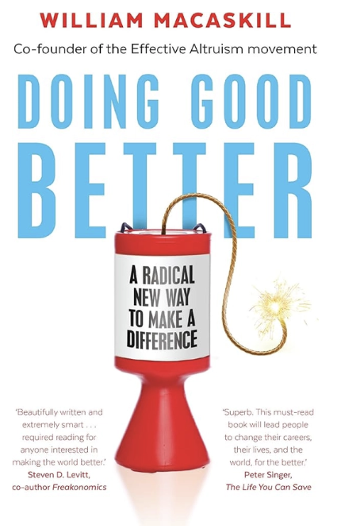

<Callout>
Welcome to Part 8 of “Last Week Tonight”, where I recap some interesting things I learnt over the last week as a college student!
</Callout>

Spring is coming! We had an absolutely incredible day today, with the cherry blossom trees starting to bloom and the sights and smells of spring beginning to show itself. I spent my Sunday going for a Student Advisory Board meeting for the Duke Human Rights Center, and had a new analyst training with the Duke Impact Investment Group today. I then spent a nice afternoon doing my schoolwork at the cafe right next to our campus together with a friend.

This phase of the semester has been busy — new commitments have taken root, including a new research project I’m working on in the field of development economics. 

We’re evaluating policy options to address deforestation in the Ivory Coast. For context, the Ivory Coast is the world’s most important producer of cocoa. To plant the cocoa, many smallholders (a portmanteau for “small farmholders”) burn down forests, evidently increasing deforestation rates. Simply imposing Pigouvian taxes on them in order to reduce deforestation is ineffective, for two reasons. First, with weak property rights, it’s hard to trace who owns the land. Second, taxes on these smallholders are politically unpalatable. Thus, a set of policies are needed. This ties nicely into the first theme for my reflections today: the Coase Theorem.

# Coase Theorem

Ronald Coase was a Professor of Economics at the law school of the University of Chicago. He was a key figure in the “law and economics” movement, having authored a famous paper titled “[The Problem of Social Cost](https://www.law.uchicago.edu/lawecon/coaseinmemoriam/problemofsocialcost)”. 

In Coase's world, assuming that there are zero costs to transactions — think of these as the costs of the exchange process itself, like searching for information, negotiating, and enforcing agreements — most disputes can be resolved in a two step process: first, a legal process to establish property rights, and second, a bargaining process to reach socially-optimal outcomes.

Consider a famous case study he cited in his paper. Alan and Bob are neighbours. Bob invested $100,000 to build a swimming pool next to his house, so that he could swim on sunny days. However, weeks later, Alan builds an additional floor on his house, which ends up blocking much of the sun.

According to Coase, how would Bob and Alan resolve their dispute? First, a legal process is needed to establish who holds the relevant property right. Coase talks about how the problem of social cost isn't one-way: "the real question that has to be decided is: should A be allowed to harm B, or should B be allowed to harm A". Yes, Alan building the additional floor is what caused Bob's pool to be invalidated. But if Bob didn't have a pool, then Alan building an additional floor wouldn't be a problem to begin with. The role of a court here would be to determine whose interest takes precedence. Assume, for the sake of my case study, that the court rules in favor of Bob: the court either requires Alan to demolish his additional floor, or settle with Bob.

In the second stage, the two parties can bargain. Bob and Alan get together. Alan sees the cost — monetary and non-monetary — of demolishing his additional floor as $500,000. Bob sees the cost — again, both monetary and non-monetary — of moving his pool as $100,000. According to Coase, Alan could theoretically just demolish his additional floor. But he probably won't. Instead, he can offer Bob a sum between $100,000 and $500,000 to move his pool. Why that range in particular?

- Well, any sum above $500,000 wouldn't make sense: it would be more affordable for Alan to simply demolish his new floor.
- But any sum below $100,000 wouldn't make sense for Bob: it would cost him more than he gets back in order to move his pool, and in the absence of a deal, he isn't the one who has to incur costs anyways.

Coase's suggestion is that the deal that is eventually reached will be socially optimal, assuming that there are no transaction costs. What are some potential examples of transaction costs?

- **Search and information costs** — Bob and Alan have to figure out each other's true valuations and gather legal information. In more complex disputes, this alone can be prohibitive.
- **Negotiation costs** — time spent haggling, hiring lawyers or mediators, back-and-forth communication.
- **Enforcement costs** — once a deal is struck, ensuring both parties actually comply. If Alan takes the money and doesn't move, Bob needs a mechanism to enforce the agreement.
- **Strategic behavior** — both parties have incentives to misrepresent their true costs. Bob might inflate his $100,000 figure; Alan might lowball his $500,000 estimate. This alone can cause deals to break down even when a mutually beneficial one exists.
- **Cognitive and emotional costs** — dispute resolution is stressful and time-consuming, and people aren't always rational maximizers, which can derail theoretically achievable bargains.

Coase's theory is interesting. Coase, though, mentioned that he regrets the direction his paper has taken. He wrote this paper to illustrate that in fact, there are transaction costs all around us all the time. Recognizing those transaction costs is precisely what Coase wanted readers to take away. To the contrary, the "Coasean World" has sometimes been used to describe a world in which institutions are not necessary, and bargaining can be used to deal with all types of disputes.

So, next time you witness a dispute, think about whether there are ways that Coase's proposal can apply, and think about potential transaction costs!

# Effective Altruism

This week, my bedtime reading is [Doing Good Better](https://www.goodreads.com/book/show/23398748-doing-good-better) by William MacAskill. This book is a foundational text to Effective Altruism, a widely-held belief amongst many in Silicon Valley.

I’ll have more to say once I finish the book (look out for a book review), but here’s a quick summary of my understanding of EA before my read of it.

Effective altruism (EA) is the idea that when trying to do good, we should think carefully about *how* to do the most good possible — not just that we should do good.

The core insight is that not all charitable efforts are equally effective. Donating to one cause might save 100 times more lives per dollar than another, so if you care about outcomes, those differences matter enormously. EA asks: given limited time and money, where can I have the biggest positive impact?

Critics argue it can be overly utilitarian, that its focus on measurability distorts priorities, or that it lets systems that create harm off the hook by focusing on charitable band-aids. There's also debate about whether the "longtermist" wing — focused on far-future risks — stretches the framework too thin.

EA also sometimes promotes the notion that you can do some slightly morally questionable things in the short-run, as long as you can justify it by doing good in the long-run. For example, you could go into a profession that earns you lots of money by exploiting flaws or manipulating the global economy, as long as you donate most of it. 

Admittedly, my view of EA has also been colored by Sam Bankman-Fried being one of the loudest proponents of it before his arrest for committing massive fraud as the founder of FTX. But I think there’s an interesting case for EA — and regardless of its ethicality, it has still been tremendously influential in the development world. 

I hope that my understanding of EA will be a valuable complement to my study on development in Africa.