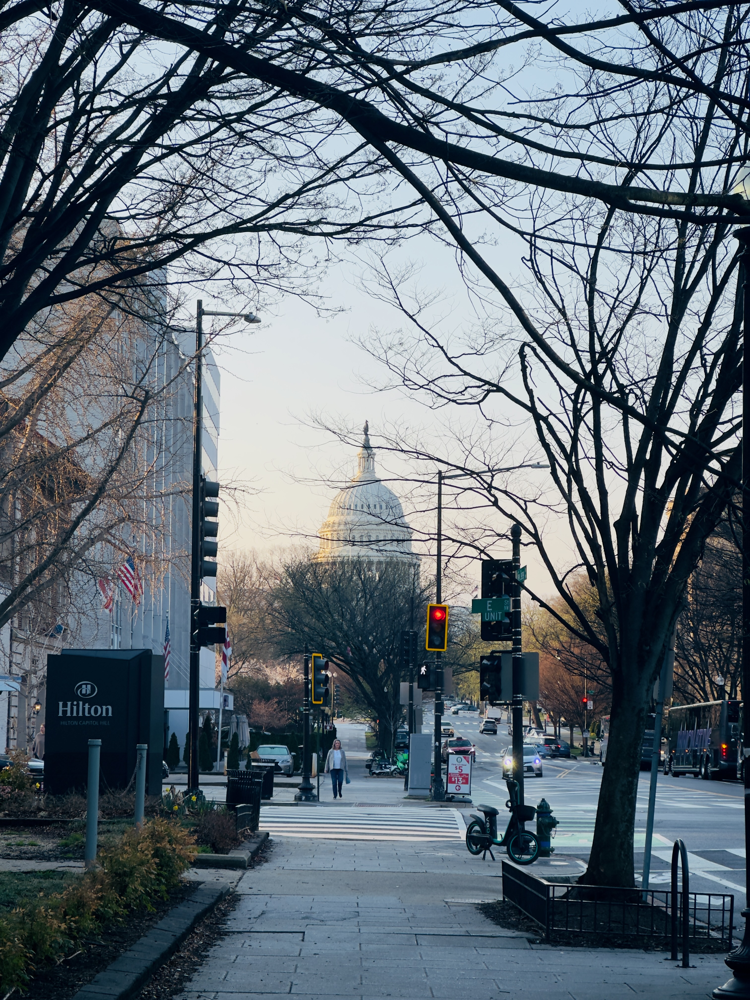
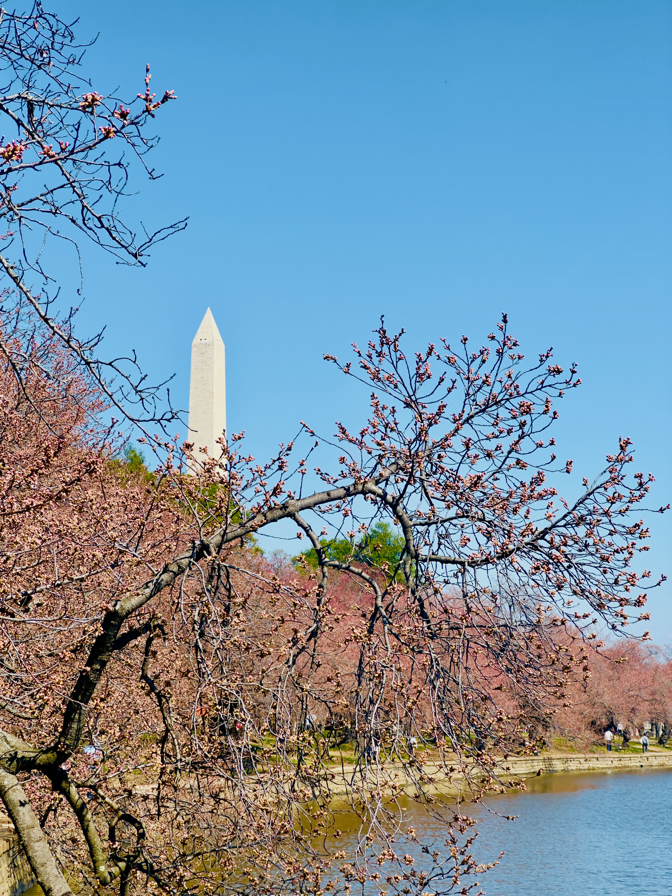
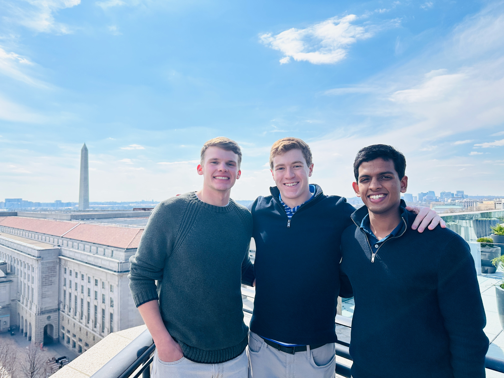

<Callout>
Welcome to Part 9 of “Last Week Tonight”, where I recap some interesting things I learnt over the last week as a college student!
</Callout>

Hello again! Last week tonight is back after spring break and an incredibly meaningful week last week. 

I’m running a little low on time to discuss things I learnt over this past week, so I’ll be doing something a little different this week - I will be writing more of a reflective piece!

# The passion delta

From Thursday till Saturday, I was in Washington DC as part of the Duke Sanford School of Public Policy’s “Policy Pathways” program. This program gave me the opportunity to travel to the capital of the US and engage with alumni & partners engaged in interesting work within different sectors.

I also had a lot of fun going on this trip together with inspiring fellow students who care deeply about building a meaningful career and making a genuine impact. As anticipated, the learning didn’t stop with talking to the interesting figures we were engaged to speak with — conversations overflowed, into bus rides, dinner tables, and ice cream trips. 

I have quite a lot of points to reflect on after this trip, but here’s one big one: **there’s a palpable difference when you’re speaking with someone who really, genuinely loves what they’re doing**. We had the chance to speak with many such people throughout this trip — some in the State Department, some in the National Geographic Society and others in the National Archives — and it struck me how much of a difference passion and investment makes. 

These passionate individuals often thought about outcomes, rather than output. For example, I was thoroughly impressed by my guide at the National Archives. A historian-cum-guide could very easily focus on merely delivering the output, one tour around the founding documents, but ours was focussed on delivering an outcome: telling a magnificent story behind the documents, and sharing her passion on the subject. Similarly, a key leader in the economic development branch at Google was inspiring in her focus on development *outcomes*, rather than pure spending targets or numerical performance “indicators” which don’t really capture the essence of development. 

One of my favorite learning points from this trip was by an award-winning storyteller, explorer and photographers with the National Geographic Society. She shared how we ought to work on projects that we care deeply about — whether it’s within our job scope or beyond — and show our love. “Show the beauty in it” was the advise she received from a mentor — rather than getting the work done the way you think it needs to be done, or **artificially “performing” to someone’s standard, share your love for work with others.

These individuals also had strong values, and weren’t going to change themselves just to land a job. To them, this was a way to gain credibility and build a brand around themselves — but more importantly, to live a coherent life, where work and life come together. 

To be clear, they were clear about one thing — doing what you love doesn’t mean you ONLY do what you love, or you can’t ever develop a love for what you do. Rather, it means living each day with a deep sense of purpose rather than just checking in and checking out. I’m reminded of the famous story of how, during the Space Race, a janitor in Kennedy Space Center, when asked what they did, replied “I’m helping put a man on the moon”. 

I’m inspired by this, and want to take this chance to do more things I really want to do. I believe this is the best approach to live a fulfilled life and also deliver the kind of high-quality work I evidently saw amongst such individuals. 

This piece was a little shorter and less substantive than normal, but I’ll be writing two pieces next week! I need to get through two high-stakes midterms, one for econometrics and another for climate change, this coming week. Once that passes, I’ll have much more breathing room. See you soon!