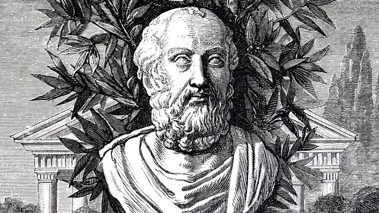

<Callout>
This piece examines what the Gorgias says about rhetoric, power and contemplation. I wrote this essay for a class in my Fall 2025 semester.
</Callout>

Gorgias explores rhetoric, power, and pathways to the good life. In this reflection, I will examine Socrates’ view of (a) rhetoric, its power and the need for it to be moderated, (b) the disjunct between appearance and reality on questions of pleasure, pain, good and bad, and (c) the need for philosophy and contemplation to live the good life.

**The power of rhetoric**

First, Gorgias establishes that rhetoricians are influential. Socrates does not contest that in his context, rhetoricians are influential (“[rhetoric] manifestly appears to me as a power demonic in greatness”). (emphasis added) He sees rhetoric’s power to spur action, from how he concedes that indeed, great rhetoricians’ counsel inspired the building of dockyards, harbours and city walls.

**Ambivalent power**

However, Socrates establishes how rhetoric’s power does not always serve good causes. This is because the skill of persuasion, in itself, is not grounded in any fundamental truths or morality. Rhetoricians’ public speech can destabilise truth and authorities of truth. For example, should a rhetorician and a doctor “have to contest in speech… which of the two ought to be chosen doctor”, it would be the rhetorician — “the man with the power to speak” — that an uninformed audience would choose. Gorgias concedes that with the “great” power of rhetoric, rhetoricians ought to “​​use rhetoric, Socrates, just as every other competitive skill” including “boxing and pankration and fighting in heavy armour”, because of its harm it might cause. With this, we cannot take the assumption that all rhetoricians are well-intentioned and knowledgeable in matters of justice — “of necessity know[ing] the just and unjust things, either beforehand or by learning them later from [Gorgias]”. Gorgias himself acknowledges the harm that might arise.

Socrates also empirically establishes how ineffective public rhetoric has been at promoting good virtue in citizens. Instead, it solely speaks to people’s desires without accounting for what is fundamentally good to them. This parallels how cookery satisfies people’s desires while medicine examines what is good for someone. To Socrates, rhetoric flatters (“supplying the city with the things it desired”) but does not succeed at “leading [people’s] desires in a different direction” and “persuading and forcing [citizens] toward the condition in which the citizens were to be better” — which is the ultimate goal of a polis in Ancient Greece. To the contrary, rhetoricians, including Pericles, seem to have made their audiences “more savage”, and therefore “more unjust and worse”.

Contemporary examples show that not all persuasive individuals use their persuasion to advance the truth, or promote goodness. Half-truths, such as President Bill Clinton’s misleading cover-up of his sexual harassment case, are increasingly common. More concerningly, inflammatory speech and actions appealing to people’s emotions, such as that used by Alternative für Deutschland in Germany, is harmful.

**Dealing with the harms of rhetoric**

Who has the duty to ensure that misleading speech does not cause harm? Is it the speaker, or the listener? I believe that Socrates passingly addresses this. In drawing the distinction between inspiring knowledge and inspiring belief, Socrates acknowledges that the orator “would not be able… to teach so large a mob such great matters in a short time”. Arguably, Socrates is cognizant that audiences might not be able to grasp the whole truth. Indeed, today, we rely on experts to fill in knowledge gaps, and many of us take their word to be true. During the COVID pandemic, we trusted that epidemiologists know what they do. This further contextualized why Fish, Stanley and Simpson argued for no platforming — given universities’ pursuit to advance truth and confidence in the truth, any speech from such persuasive orators which harms trust in universities and their academic process should be restricted.

My issue with this argument, though, is that the same principle could be applied to the rest of society as well — and I think Socrates too makes the case for general restrictions to free speech, not just in specific settings.

All this is to say, perhaps Socrates would be sympathetic towards restrictions on harmful free speech, simply because he does not have full faith in there being a discerning audience that can parse speech and find the truth, nor does he have full faith in public rhetoricians to nurture good.

**Power - what does it mean? Is freedom power?**

Shifting from the societal effects of rhetoricians’ power to how this power affects rhetoricians (and all powerful people), Socrates first examines means to be powerful. Polus argues that power is having options — in his case, orators are powerful because they may “kill whomever they wish, and confiscate possessions, and expel from the cities whomever it seems good to them”. There are few restrictions to a powerful person’s freedom.

With that said, Socrates contends that for someone intending to live the much-desired good life, unfettered freedom is not the way to go. In his argument, I interpreted the concept of the distinction between the higher good as rising above base desires.

Socrates makes an interesting semantic distinction, between what one “wish[es]”, and what “seems to them to be best”. I thought the word “wish” was interesting — it reveals a sense of aspiration, something elevated. “Seems”, on the other hand, is surface level. It is confined to the realm of appearances. Perhaps this understanding is not unique to Socrates. Polus too acknowledges this, having conceded that the man who does something that seems good but is indeed bad “does not seem… to do what he wishes”.

Shifting from the semantic to the philosophical, Socrates makes arguments distinguishing the base and the noble throughout this text. For example, Socrates proves that even though punishment might be painful, this is still abstractly good (possibly, good for the soul). This is most powerfully conveyed by the inversion of the word “wretched”. There are two meanings that this word carries, one belonging to Polus and one belonging to Socrates. In 469a, “wretched” is defined by Socrates as a spiritual degradation, in response to acting unjustly. When Polus uses the same word in 472e, to define how one would feel if punished, Socrates is quick to refute it — to Socrates punishment is a form of redemption, painful on the surface but healing within. What is the implication of this? Freedom should be exercised with the necessary discernment. Such discernment enables one to determine what is truly good, versus what appeals to our desires but might not be good.

**Contemplation to achieve the good life**

How may one get better at discernment? I would argue that Socrates has a clear answer: knowledge and philosophy. In the text, it is acknowledged by both Polus and Socrates that “doing what seems good without intelligence is a bad thing”. Knowledge promotes discernment needed to prevent one from using their power to their own detriment, doing “unjust and based things”. In the example we discussed in class regarding our professor’ son and his desire for a baseball bat, I perceived this as a case of falsely valuing the baseball bat. In the absence of knowledge, we falsely value the item. Even amongst highly educated people, such cognitive distortions are common. The most prominent example is how we often weigh immediate pleasures more than future pleasures — this is why we find it easier to have those extra one or two donuts.

Knowledge also prevents the excess of ambition, temptation and desire that “thoughtless”, “uninitiated” (493b) might face. Instead, they may enjoy an “orderly” life (493d). This word carries some additional meaning given the Greeks, famously Aristotle, believed in a natural order. If order in a civil society is a dream worth aspiring to, knowledge is the way to get there, according to Socrates.

Is true knowledge possible? According to an article by Julian Dutra published by the University of Chicago’s Center for Practical wisdom, Socrates argued that perfect, all-encompassing knowledge is something “only the gods can achieve”. What mankind can do, however, is “to keep searching, keep revising our concepts and conclusions. That is, all we can do is to search for wisdom or, in other words, to philosophize.”. Aristotle, along similar lines, argues that the best life is reserved for someone with theoretical knowledge (sophia) about the cosmos and the laws of nature, and the ability to practically apply moral knowledge (phrónesis). This is the best way to suppress the base part of the human mind.

Indeed, this is the practical case for why Socrates justifies his life of contemplation amidst a scathing attack by Callicles. Callicles argues that Socrates has left the “city and the agoras”, the places where individuals become “highly distinguished”, and would “die” if a “very lowly and vicious accuser… wished to demand the death penalty for you”. The implication is that Socrates’ life of contemplation serves no practical end, not even the basic need of self-preservation, let alone the higher needs of meeting one’s potential. In response, Socrates makes the case that “the true man” (as opposed to the “distinguished man”) “must reject living any amount of time whatsoever, and must not be a lover of life”. This is a spiritual call to eschew worldly attachment. Further, “believing… that no man may escape his destiny, he must investigate what comes after this: In what way may he who is going to live for a time live best?”. The analogy of the Thessalian women introduces a mythological element to his argument. The hubristic women in Thessaly, using their place in the planet for selfish purposes, represent the risk of losing “the things dearest to us” while pursuing “power in the city”. To the contrary, the life of contemplation encourages moderation and thought, and ultimately is the definition of a “good” life.

In summary, Socrates, in Gorgias, makes the case for the life of contemplation. A common theme in this text is the rift between how things appear to be and what things are — misinformed belief versus informed knowledge, desires versus elevated, pain versus redemption, pleasure versus corruption. The conclusions reached by Socrates have clear implications for how we should think about freedom and moral obligation. Specific to speech, there is a strong case for restricting speech that seeks only to persuade and not to appeal to the people’s higher faculties and “goodness”. Broadly, in leading the good life, our freedoms should also be constrained by a broader sense of right and wrong. The best way to achieve this is through a process of contemplation and deliberation. While perfect knowledge is impossible, the process of contemplation alone is a pathway to a good life.