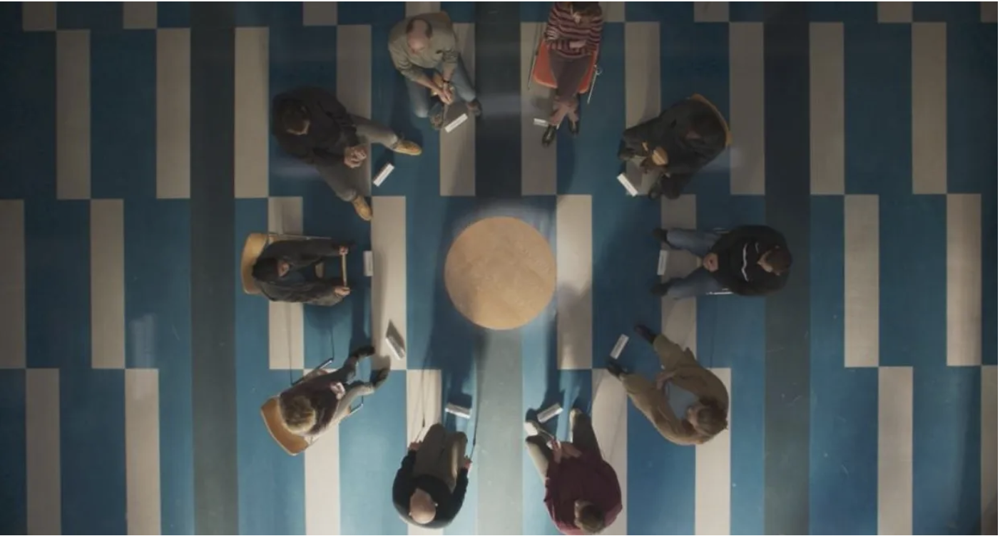

<Callout>
This semester, I took a fascinating class on restorative justice: an alternative philosophy of justice, focused on promoting victims’ healing rather than retribution.

The class compelled me to question assumptions I had about justice and what it took to build a just world. Below is a reflective essay I wrote to round out my class. But it’s only one of what I hope will be a two part essay, with the second being a reflection on what it takes to achieve the kind of justice I propose at the end of this essay.
</Callout>

“We’ve discussed some of the problems with criminal justice in this class. How does restorative justice fix these problems?” I was never really satisfied with this question whenever it came up during show and tell. It’s true that criminal justice needs reform in the US – incarceration rates are high, crime remains high, and racial minorities are disproportionately represented in carceral institutions. On the other hand, punitive justice in Singapore appears effective, suggesting that punitive justice is not inherently flawed. Why can’t the US just build a better punitive justice system? Why does the US need something radically different, when punitive justice has the potential to work? Perhaps my biggest intellectual transformation in this class was questioning what it really means for a justice system to “work.” While my initial view was primarily utilitarian (i.e. minimizing crime rates), this class led me to a broader view of justice that also promotes moral deliberation and healing. Given restorative justice’s effectiveness at achieving these two further aims, restorative justice (RJ) should accompany punitive justice in a hybrid system.

**Justice beyond Consequentialism**

Over the course of this semester, I began to see the shortcomings of my utilitarian perspective on justice. Prior to this class, I felt that the primary measure of quality for a justice system was how good it was at minimizing crime.

Two problems arise when we equate justice with low crime rates. First, crime surely isn’t the only form of injustice in the world. In Chapter 6 of The Little Book of Race and Restorative Justice, Fania Davis highlighted the various manifestations of structural injustice that African Americans in the United States face, offering just one example of how injustice exists outside of crime. Implying that a low-crime society is a just one leads us to ignore these various other forms of injustice, making my initial view narrow. To be clear, I still believe that minimizing crime is important. The pursuit of minimizing crime can nudge public institutions to address underlying causes of crime which themselves are other forms of injustice – such as poverty and employment discrimination. However, forms of injustice will remain even when crime is low, and therefore, our fight for a more just world should not stop at keeping crime minimal.

A second problem with the utilitarian view is that it could disregard human dignity in the pursuit of keeping crime low. Simplistically viewing justice as an optimization problem of minimizing crime would often lead us too far, even to the end of disregarding human dignity. Sandel would concur with my criticism of utilitarianism’s overreach; he argued that consequentialism leaves human rights contingent on utility, rather than viewing them as inherently important (37).

Given these two limitations, I realized that the utilitarian aim of minimizing crime is an insufficient roadmap for building a just society. I needed a broader view of what justice requires.

**Moral deliberation**

In our pursuit of a just society, we must first come together and figure out what a just society looks like. To do so, we should be comfortable discussing, “challenging, contesting, … listening to, and learning” one another’s moral convictions, and build a society that embodies these values. In Sandel’s words, we should engage in public “moral deliberation” (268).

Why is this critical? Public moral deliberation enables us to build more just social institutions. If institutions inevitably advance some conception of morality or another, as Sandel argues (253), then we are better off if all citizens, rather than just the powerful elite, decide what virtues should guide our institutions. Iran – a country I spent this semester delving deep into for another class – offers a negative example of how societies become unjust in the absence of open moral deliberation. In September 2022, Iran’s “morality police” arrested and beat the 23-year-old Mahsa Amini to death for not wearing her hijab (veil) properly. Throngs of Iranians took to the streets protesting such injustice, because most of the population did not see wearing the hijab as a moral duty. If the Iranian regime had allowed collective deliberation on the moral status of the veil, they might have built institutions that respected, rather than violated, their citizen’s values – institutions far different from the “morality police”. A successful politics of moral deliberation can help us create public institutions represent our moral beliefs, making our societies more just.

Restorative practices are helpful in facilitating this moral deliberation because of their emphasis on storytelling and their flexible process. The “choose your own adventure” sustained dialogue circle we conducted in class, regarding sexual harassment in schools, offers a vivid illustration of these two facets of RP.

Firstly, the circle promoted storytelling. Stories are critical in our moral lives: according to Alasdair MacIntyre, we form our moral views based on the narratives we find ourselves part of (Sandel 224). If MacIntyre is right, then the best way for us to have a conversation about morals is for us to collectively share and discuss the stories that our morals are based on. In our class Circle, prompts were specifically tailored to encourage participants to share their stories. One example of such a prompt invited us to share a story of a time we learnt about the red lines in romantic relationships. By sharing our story and listening to others’ stories, we understood how each of us arrived at our beliefs on red lines. Consequently, we had a harmonious, constructive conversation on how to collectively respond to sexual harassment.

Besides prompting storytelling, Circles is also a flexible process. Restorative practices lend communities, rather than facilitators, the power to steer the conversation in the direction they want to go. RJ formats and pre-prepared questions are meant to be a “compass, not a map” to justice (Zehr 10) with broad principles rather than specific prescriptions. Such flexibility makes collective deliberation more authentic. For instance, when our Circle group discussed the questions on the report prepared by the Victoria University in Wellington, our conversation was stale – some of the questions simply felt irrelevant. Sensing that our group wanted to talk about a more immediate problem – our fears of increased sexual harassment in the Greek life rush period – our Keepers changed course. As a result, our conversation turned much more concrete, lively, and meaningful.

In summary, restorative practices are an effective method of prompting the collective moral deliberation that I see as a critical facet of a just world.

**Justice and healing**

Lower crime rates and moral deliberation aside, we ought to build better immediate responses to harm, to allow victims to heal. While preventing future crime and building just institutions prevents harm, Brookes argued that the question remains: “What do we do now that harm has already been caused?” (3). Zehr (10) argued that promoting victims’ healing is the right thing to do. His argument is interesting, but he doesn’t explain why healing is the right thing to do. But I agree, and I will attempt to justify Zehr’s argument.

Helping victims heal is the right thing to do because of our “obligations of solidarity” towards those who suffer. When crime happens, victims are not the only ones who suffer. In a sense, an entire community suffers, because a norm was violated. If moral obligations sometimes stem from membership of communities (Sandel 224), then societies have an “obligation of solidarity” to help victims heal. In fact, this obligation is instinctual; we go out of our way to help those we love to heal from harm they experience. Picture a child who trips on a rock, falls, and is now bleeding. What will we do? Will we simply move the rock and prevent others from doing the same? Likely not. We would also probably gingerly bandage the child’s wound, and assure them that everything will be alright. If helping others heal is instinctual, then why do we neglect healing in a societal context, and instead focus on dispassionate expediency in the justice system?

But to be honest, the real catalyst for my focus on healing wasn’t this philosophical argument. Instead, it was because I developed a greater sense of empathy for victims of crime through this course. Generally, we have no trouble seeing the pain that victims face when crime happens to them; in fact, victims’ pain is often spectacularized to help prosecutors win trials. However, we do not see the pain they go through during and after the trial. Chanel Miller’s emotional victim impact statement depicts this pain powerfully. Miller’s pain did not magically end after the trial. Instead, the trial traumatized her even more — gaps in her evidence were weaponized by opposing counsel to undermine her credibility, and the defendant deflected blame towards her rather than taking responsibility. Ultimately, Miller’s pain persisted for years, even after the judge banged the gavel and, to (ironically) use a common legal aphorism, justice was served. Evidently, our present conception of justice neglects victims’ healing. My empathy for victims’ prolonged pain led me to see healing as a goal worth pursuing.

Restorative processes offer a guide to start the healing process. Healing is intentional in RJ. According to Zehr (14-15), RJ was designed specifically to center justice around giving victims the things they need to heal: information, truth-telling, empowerment, and restitution. The movie All Your Faces illustrates how pre-conferences and facilitated dialogues meet these four needs and therefore facilitate healing. Chloé Delarme struggled for years with the trauma of being abused as a child by her brother Benjamin. In pre-conferencing, the restorative justice facilitator Judith prompted Chloé to think of the questions to which she needed answers. During the conference, Chloé received most of the answers she wanted to hear. Throughout the process, Chloé was empowered — she was allowed to shape the process based on what she needed. Finally, even though the RJ process didn’t end with a formal apology, it succeeded at promoting Chloé’s healing. In her final analysis, Chloé claimed the encounter helped her move on from “grief, and immense anger… [and] hatred”. Chloé’s story reveals how restorative practices are a useful process by which we can achieve our aim of healing. Restorative practices translate human empathy into action – into compassion.

**A hybrid justice system**

As I’ve illustrated throughout this essay, my views on what it takes to build a just world have broadened significantly. I see my three aims for justice – low crime, moral deliberation, and healing – as compatible. With that, I believe in a hybrid justice process where punitive justice and restorative practices go hand in hand to achieve these three ideals.

Punitive justice and restorative justice serve different purposes; and they are not mutually exclusive. Zehr acknowledges this claim, arguing that restorative justice is not meant to replace punitive justice, at least in the short run. Instead, it balances the current legal system’s excessive focus on the “public dimension” of crime, rather than the “private dimension” of harm (12). Therefore, it is theoretically possible to blend punitive and restorative justice. In fact, such a hybrid system might be desirable: practitioners of RJ in transitional justice contexts suggested that a hybrid system is most effective (ICTJ footnote 49). Perhaps, I argued in my second essay, a hybrid approach is the best solution to prevent RJ from being misused to couch impunity under the veneer of reconciliation, while enabling societies to reap the various fruits of a restorative system.

But do we even need a punitive system to keep crime low? Why can’t norms replace laws as a mechanism to prevent crime? I view the punitive justice system as an “insurance policy”. If nothing else stops someone from causing harm — not norms, not respect for human dignity — then perhaps clear knowledge of what the consequences will stop them. This mechanism was intentionally conceived. Foucault argued that we began to neatly map crimes to punishments so that people would know what exactly would happen to them if they committed a crime (95-97). The consequences of crime become predictable and consistent, and therefore potential criminals will account for these consequences when deciding whether to commit crime.

In an early reflection, a classmate questioned whether this mechanism actually works, pointing to continued high crime in the US despite a punitive system. I have two responses. First, socioeconomic factors undermine deterrence. If extreme destitution makes the benefits of crime outweigh the costs – even when including punishment – crime will persist. Secondly, enforcement capabilities matter. The threat of punishment holds no water if it’s unlikely to happen. In Singapore’s case, strong enforcement is probably as important to safety as strict laws. All in all, I am still convinced that punitive systems have a deterrent effect that will work when all else fails – an “insurance policy.” For this reason, I continue to support parallel existence of a punitive justice system alongside our use of restorative practices.

Moving from theory to practice, is it possible for governments to systematize RJ alongside punitive justice? In her essay Beyond Restorative Justice: Radical Organizing Against Women, Andrea Smith offers a harsh critique of government-led restorative processes. Smith claims the government cannot ethically lead restorative processes for domestic violence because government is partly responsible for the violence (257). Smith’s argument triggers a bigger question on whether governments can be involved in restorative processes when they share some blame.

I personally think government has the potential to do great good. If the government, this Leviathan, can inflict tremendous amounts of harm, then it can also do great good. My view is particularly true in democracies. Democratic governments are imperfect, but they are ours, and we can use them as a vehicle to build the communities we want to create. An inspiring example of how governmental authority and resources can create great good came to me in my interview with Mr. Mohammad Julkipli, the Attorney-General of the Philippines’ Bangsamoro Autonomous Region (BARMM). The BARMM incentivized and provided logistical and technical support for Katarungang Pambarangay (village justice). Through the government’s partnerships with local actors, RJ has become a viable, trusted form of justice in Bangsamoro.

**Conclusion: Just work for everyone**

Justice requires more than low crime rates – it also requires moral deliberation and healing. My essay defended a hybrid justice system; but perhaps there remains a final remaining question: where do we fit in? Towards the end of the course, I experienced an empowering epiphany. What if justice isn’t only the work of justice systems and institutions? What if every one of us is an agent of justice? In fact, my thought wasn’t actually an epiphany – it was a rediscovery. In my very first reflection, I talked about how everyone has a role in the justice system. Perhaps that statement needs revising. Everyone has a role in building a just world. Moral deliberation and healing, as I argued, isn’t work that only elites or “trained professionals” should do – that work is for everyone. If we all step in, rather than stand by, we can have hope for a just world. To build a just world, we don’t need magic. We need just work.

My work starts now. I have an idea to start facilitating preventive circles within my community in Singapore at a grassroots level, in order to build a stronger community and deal with neighborhood issues. This project should be an interesting start; we’ll see where it leads me!

<aside>
*Cover image credits: All Your Faces*

*Works Cited*

All Your Faces. Directed by Jeanne Henry, France, 2023, https://letterboxd.com/film/all-your-faces/.

Brookes, Derek R. Beyond Harm: Toward Justice, Healing and Peace. Relational Approaches.

Chanel Miller Reads Her Entire Victim Impact Statement. Directed by 60 Minutes, 2019.

Davis, Fania E. The Little Book of Race and Restorative Justice: Black Lives, Healing, and US Social Transformation. Good Books, 2019.

Foucault, Michel. Discipline and Punish: The Birth of the Prison. Translated by Alan Sheridan, Vintage Books, 1995.

International Center for Transitional Justice. Transforming Social Relations: Restorative Responses to Massive Human Rights Violations | International Center for Transitional Justice. https://www.ictj.org/resource-library/transforming-social-relations-restorative-responses-massive-human-rights. Accessed 9 Oct. 2025.

Sandel, Michael J. Justice: What’s the Right Thing to Do? Farrar, Straus and Giroux, 2010. Amazon.

Smith, Andrea. “Beyond Restorative Justice: Radical Organizing Against Violence.” Restorative Justice and Violence Against Women, 2009.

Victoria University of Wellington. “Sustained Restorative Dialogue | Te Ngāpara / Centre for Restorative Practice | Te Herenga Waka.” Victoria University of Wellington, Victoria University of Wellington, 17 Nov. 2022, https://www.wgtn.ac.nz/restorative-justice/research-evaluation/reports-and-publications/sustained-restorative-dialogue.

Zehr, Howard. The Little Book of Restorative Justice. Good Books, 2002.
</aside>