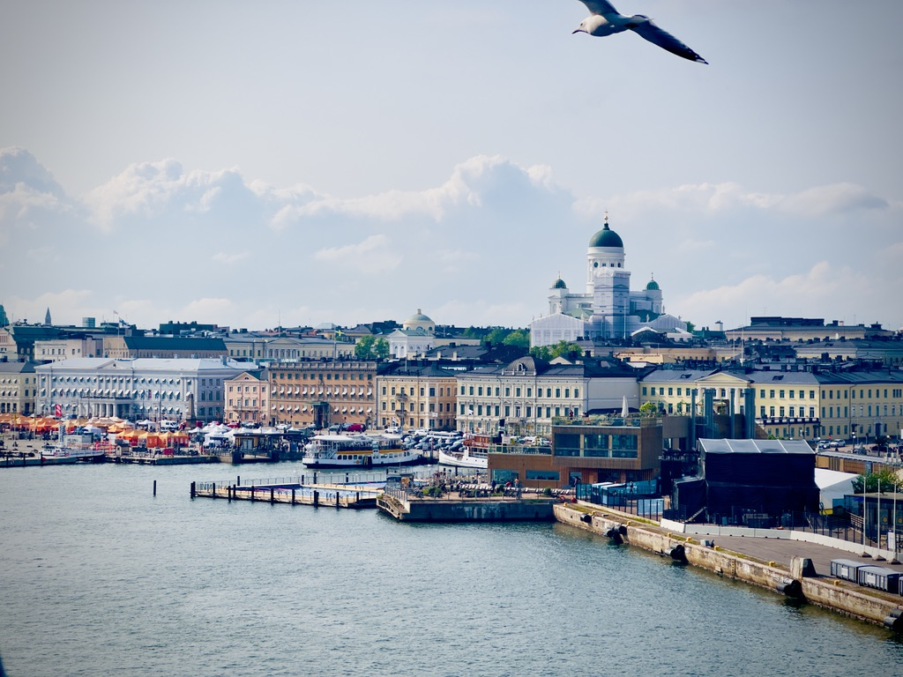

Here’s Part II of my reflections from my happiness exploration journey: this one’s on my trip to Scandinavia!

One can’t speak about shaping happiness without bringing up examples from at least one of the five Nordic countries — Finland, Sweden, Denmark, Norway and Iceland. Should we believe the rankings — are the Nordic countries genuinely the happiest countries in the world? If so, how?

In my journey learning about happiness and how to promote it, I wanted to answer these questions. To do so, I took a trip to Helsinki (Finland), Stockholm (Sweden), Copenhagen and Aarhus (Denmark).

Before I get to what I learnt there, here’s some context. A long time ago, people used to think happiness was not within our control. It was divinely ordained— if you’re happy, it’s because you pleased the gods. If you aren’t, then you’ve done something really wrong.

However, over time, people realised that there are certain things you can do to influence your overall life satisfaction. From there, promoting the happiness of their people became a key aim of governments: Aristotle believed the goal of the state was to help its citizens achieve eudaimonia — long-term happiness and flourishing. I found this idea interesting. In my opinion, the state can implement policies that foster the conditions for happiness. However, ultimately, a lot hinges on the people’s psyches and approaches to life. It’s this second bit that I wanted to delve deeper into during my trip.

I spent my time in the three countries immersing myself in the local culture and having casual conversations with many locals. I also had the opportunity to chat with three professors from Sweden and Denmark, in the fields of geography, sociology, and economics, to hear their perspectives. So: Are the Nordic countries as happy as they are said to be? Well, sort of.

People in all three countries shared that they see themselves as “contented” with their lives rather than outwardly happy or “smiley”.

For one, it’s a matter of perspective. “Danes don’t complain,” one shared — “they’d rather see even the bad days as an opportunity for hygge.” What’s hygge? Roughly, this Danish word translates to feeling cosy. In Denmark, people often enjoy lighting a candle, making hot chocolate, and wrapping themselves in a thick blanket. But that’s not the only form of hygge. Volunteering with an NGO (which, according to a Danish professor I met at a cafe in Aarhus, is a commonplace practice among Danes), cycling around the streets, and even tackling a challenging problem at work that will make life easier for one’s colleagues can all be seen as hygge.

What else explains this contentment?

I think the people of the Nordic countries prefer to see humans as just that — humans. They sought to build an incredibly egalitarian society. According to a professor I met from Stockholm University, outlandish displays of class, such as fancy cars or grand homes, are eschewed. Instead, people prefer to remain humble and treat everyone with equal respect. In Sweden, they have a word for this — lagom. Naturally, this engenders more contentment with one’s state of things. And, of course, basic necessities are often provided to citizens, given the strong welfare state in the Nordic countries.

Perhaps one symbol of egalitarianism is the Finnish sauna. It’s a haven for most Finns, and a not-to-be-missed experience. Saunas are a hugely important means of relaxation for the Finns, and yet they are incredibly accessible to people of all backgrounds. It’s not like a fancy restaurant that ends with an astronomical bill, or a visit to a theme park that can be out of reach for many. You’d see people of many different backgrounds coming together in saunas.

Secondly — and this is a significant point — interpersonal trust is a foundational part of Nordic citizens’ contentment. It was surprising to me that citizens in the Nordic countries accept the high tax rates. I asked a Swedish professor of sociology about this. “A good life isn’t just one where you’re wealthy”, she said, “it’s one where you can also help others in your community”.

Regarding unemployment benefits, the Swedes don’t believe that most unemployed individuals are lazy or averse to work. Instead, they might have taken a risk and failed, or have to take time off to reskill. Again, the trust to assume the best in one another enables people to accept that helping others is a source of joy for oneself. As a side benefit, according to my guide at the Nobel Prize Museum in Stockholm, the knowledge that others have your back also promotes risk-taking innovation, explaining why the Nordic countries have managed to lead the way in many fields.

Of course, the other half of the equation is that even the wealthy benefit from the taxes they pay — a Finn I met at a forest cleanup shared that most Finns are incredibly happy with the public education and healthcare system, to which all Fins have access and benefit from. The quality of public services prevents a system where there is all the downside and no upside for most of the tax base.

Finally, the Nordic countries have a strong focus on relationships. It is undeniable that our loved ones are treasured sources of well-being. When I visited the Happiness Research Institute’s museum in Copenhagen, I walked into a room filled with Post-it notes on which visitors had written down what made them happy. Not a single Post-it note mentioned money or work. Most talked about their family, significant others, and pets.

The trust I mentioned earlier provides a strong foundation for autonomy at the workplace. Managers trust employees to complete their work to a high standard, and employees trust that their managers are looking out for them, removing obstacles where necessary. According to the Danish professor I spoke with, the state generally refrains from intervening in the relationship between employer and employee. Much is left to mutual trust.

“We’re not averse to working on weekends”, said a Finn I met at a cafe in Helsinki, “if the work needs to get done, we’ll get it done”. Interestingly, the people I spoke to didn’t refer to this as work-life balance. They shared that the line is blurred — but not in a bad way. At least to the people I spoke with, work is a positive addition to life.

Yet, there was a clear understanding that work is just one part of life. Culturally (and not just ideologically), co-workers are accommodating when new parents take half a year off with their babies, or work fewer hours if their children are unwell. Family time is treasured and valued in the Nordic countries, and this is undoubtedly a great source of contentment.

Are the Nordic countries perfect? Certainly not. They face their fair share of issues, and it would be impossible for me, as a tourist in the summertime, to see the nuanced realities and potential underlying challenges of life in these countries long-term.

However, my experience in Finland, Sweden, and Denmark has shown that governments can indeed play a significant role in fostering happiness. Ensuring high levels of trust (not only in government, but also in one another), consultative leadership, and robust safety nets can help foster contentment. Alongside this, people must also build a culture where humility is valued over greed, collaboration is valued over competition, and trust is valued over suspicion. We all have it within us to take the first step in building that culture wherever we go.

It’s a hygge thought, but as I draft this article from my aeroplane seat on my way back to Singapore, I’m dreaming about what I want to do in my community to nurture happiness and contentment! See you next time!
